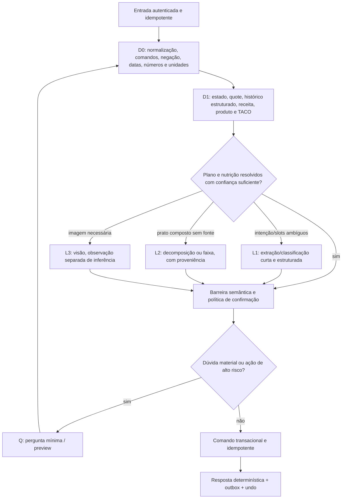
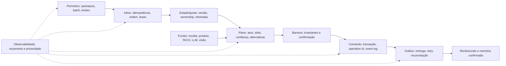

# Auditoria completa do fluxo conversacional e do registro de alimentos

- **Data:** 11/07/2026
- **Status:** levantamento concluído; patch mínimo seguro das mudanças locais implementado na PR #20; idempotência completa permanece futura
- **Escopo:** WhatsApp, conversa, estados, registro/correção/consulta de alimentos, nutrição, LLM, persistência e entrega da resposta
- **Fora do escopo do levantamento original:** alterar código, banco ou produção. A autorização posterior e o patch mínimo correspondente estão registrados na seção 20; os demais achados continuam sem implementação.

## 1. Conclusão executiva

O bot tem uma base boa de validação estruturada, TACO, produtos, estados e testes unitários, mas hoje ainda não consegue garantir os três resultados exigidos simultaneamente:

1. registrar exatamente o que o usuário quis dizer;
2. nunca perder, duplicar ou corromper uma operação quando uma dependência falha;
3. recuperar uma conversa sem cair em uma resposta genérica ou gastar LLM desnecessariamente.

Não existe uma forma honesta de prometer que uma LLM “nunca errará”. O objetivo alcançável é mais forte do ponto de vista de produto: **nenhum erro incerto deve virar uma gravação silenciosa ou irreversível**. Quando a interpretação não for segura, o sistema precisa detectar a incerteza, preservar o que já entendeu, fazer a menor pergunta possível e retomar exatamente do ponto interrompido.

O registro consolidado contém **233 achados: 33 P0, 175 P1, 24 P2 e 1 P3**. O índice canônico de P0 está na seção 6.1; as contagens se referem exatamente ao snapshot local descrito na seção 2.

Os riscos mais graves observados são:

- uma mensagem pode ser marcada como processada antes de o usuário receber uma resposta e depois ser descartada nos retries;
- lotes do webhook com mais de uma mensagem têm apenas o primeiro elemento processado;
- operações de refeição e contexto atravessam múltiplas escritas sem uma transação única;
- a correção local de duplicidade por `alimento + gramas` pode apagar um consumo legítimo repetido;
- falhas de enriquecimento podem ser persistidas como `0 kcal` e `0` macros;
- renomear um alimento pode zerar calorias/macros porque usa uma chamada que, por contrato, não calcula nutrição;
- o modo `manual` e o nível de detalhe são configuráveis, mas não governam o pipeline conversacional;
- referências ao histórico podem perder itens e há um estado de seleção criado pelo fluxo que o handler não roteia;
- imagens são registradas imediatamente com fonte/confiança incorretas, mesmo quando os valores foram estimados visualmente;
- correções destrutivas ou ambíguas podem ser executadas por decisão de LLM sem confirmação proporcional ao risco;
- faltam timeout, orçamento, limite de saída e telemetria para quase todas as chamadas de LLM;
- a suíte verde é quase toda unitária e mockada; não há testes de integração nem E2E do fluxo WhatsApp → banco → resposta.

## 2. Base exata da auditoria

### 2.1 Snapshot do repositório

- Branch: `main`.
- `HEAD`: `0be8584` (`Merge pull request #19 ...`).
- A auditoria considera o `HEAD` **mais as mudanças locais não commitadas** existentes antes de seu início.
- Nenhuma dessas mudanças foi revertida, commitada ou enviada ao remoto.

Arquivos locais já modificados antes da auditoria:

- `package-lock.json`;
- `src/lib/bot/flows/meal-log.ts`;
- `src/lib/bot/router.ts`;
- `src/lib/llm/prompts/analyze.ts`;
- `src/lib/llm/prompts/contextual-correction.ts`;
- `src/lib/utils/formatters.ts`;
- `tests/unit/bot/append-items-routing.test.ts`;
- `tests/unit/bot/log-food-to-meal.test.ts`;
- `tests/unit/bot/meal-log-consolidation.test.ts`;
- `tests/unit/bot/router.test.ts`.

Este documento é a única escrita produzida pela auditoria e permanece como arquivo novo não rastreado. Os dez arquivos preexistentes acima não foram editados, revertidos, staged, commitados ou enviados por este trabalho.

Quando um achado depende dessas mudanças, ele é marcado como **LOCAL**, para não ser confundido com o comportamento da `main` remota.

### 2.2 Evidência automatizada

- Vitest: **74 arquivos e 1.099 testes passaram**.
- ESLint: **0 erros e 21 warnings**.
- TypeScript: **10 erros**, concentrados em fixtures/mocks de testes e campos de schemas que ficaram obrigatórios.
- `tests/integration/`: inexistente.
- Testes Playwright/E2E: nenhum arquivo encontrado, embora exista o script `test:e2e`.
- CodeRabbit CLI: não instalado; nenhum código foi enviado a um serviço externo durante esta auditoria.
- Banco de produção, Meta, OpenRouter, Ollama e Whisper não foram chamados. Achados que dependem do comportamento real desses serviços são classificados como risco ou hipótese, não como bug comprovado em produção.

### 2.3 Trabalhos anteriores incorporados

O documento revalida e incorpora as frentes ainda abertas de `docs/superpowers/plans/00-WS-CONTROL.md`:

- WS3 — continuação de refeição;
- WS4 — robustez de rótulo/visão;
- WS5 — deduplicação do webhook versus entrega da confirmação;
- WS6 — coerção de `DECIMAL` no fluxo de produtos.

Esses planos não são tratados como prova de correção: o código atual continua sendo a fonte de verdade.

## 3. Como ler os achados

### 3.1 Natureza da evidência

| Código | Significado |
|---|---|
| **BC** | Bug confirmado: o caminho atual do código prova o comportamento. |
| **RP** | Risco provável: a arquitetura permite a falha, mas a reprodução depende de timing, serviço externo ou dado real. |
| **LR** | Lacuna de requisito/produto: uma entrada plausível não tem contrato definido. |
| **H** | Hipótese a validar com corpus, produção ou teste de integração. |
| **LOCAL** | Introduzido ou alterado no worktree não commitado. |

Os caminhos de evidência são relativos à raiz do repositório. Para lacunas por ausência, a superfície citada foi pesquisada com `rg`; ausência está classificada como **LR/H/RP**, salvo quando o próprio caminho de execução comprova o fallback. Referências abreviadas como `meal-log.ts` significam o arquivo já nomeado no contexto da seção (`src/lib/bot/flows/meal-log.ts`).

### 3.2 Severidade

| Nível | Critério |
|---|---|
| **P0** | Pode causar mutação silenciosa/material ou destrutiva sem guarda normal, perda definitiva, quebra entre usuários, duplicidade sistêmica ou custo/abuso relevante. |
| **P1** | Erro localizado de intenção, quantidade, refeição, contexto ou resposta, normalmente reversível, mas que exige correção do usuário ou recuperação do fluxo. |
| **P2** | Recuperação ruim, custo/latência desnecessários, observabilidade insuficiente ou caso de borda relevante. |
| **P3** | Consistência, clareza ou manutenção; baixo impacto isolado. |

### 3.3 Dimensão de custo

Cada salvaguarda é marcada por uma das estratégias:

- **D0** — regra pura/local, sem LLM;
- **D1** — banco/cache/lookup local, sem LLM;
- **L1** — modelo pequeno para classificação/extração curta;
- **L2** — modelo nutricional principal;
- **L3** — visão;
- **Q** — pergunta objetiva ao usuário;
- **R** — retry/fallback controlado.

## 4. Fluxo atual resumido

```text
Meta webhook
  → parseia somente um evento/mensagem
  → insere processed_messages
  → texto | áudio→transcrição | imagem→visão
  → encontra/cria usuário
  → onboarding ou contexto ativo
  → regras de intenção; LLM se nenhuma regra casar
  → flow handler
  → análise de alimento por LLM
  → TACO → produtos/OFF → decomposição → estimativa LLM
  → find-or-create da refeição
  → insere itens e recalcula total
  → envia resposta pela Meta
  → salva histórico e vínculo da mensagem
```

O desenho mistura três responsabilidades que precisam de contratos diferentes:

1. **entender** a mensagem;
2. **decidir** se há confiança suficiente para mutar dados;
3. **executar** a mutação e garantir a entrega/idempotência.

Hoje, uma saída válida no schema frequentemente atravessa as três etapas sem uma segunda barreira semântica.

## 5. Invariantes de produto e engenharia

Estes invariantes são a definição operacional de “cercar o erro”. Qualquer desenho futuro deve prová-los.

### 5.1 Entendimento e conversa

- **INV-01 — Sem descarte silencioso:** toda mensagem suportada recebe resultado; tipo não suportado recebe orientação específica.
- **INV-02 — Uma mensagem, todos os eventos:** todos os `entry/change/messages` de um webhook são enumerados.
- **INV-03 — Ordem/reconciliação por usuário:** uma fila por usuário usa `event_at`, `received_at` e tie-breaker estável dentro de uma janela limitada; duas transições não concorrem, e evento ligado a uma versão antiga é reconciliado em vez de aplicado cegamente. O transporte não promete ordem causal perfeita.
- **INV-04 — Contexto válido:** estado tem schema/versionamento; estado corrompido ou expirado não vira intenção nova silenciosamente.
- **INV-05 — Retomada:** uma resposta parcial do usuário é incorporada ao estado; o bot pergunta apenas o que ainda falta.
- **INV-06 — Multi-intenção:** registrar + corrigir + consultar não é forçado arbitrariamente a uma única intenção.
- **INV-07 — Negação e contraste:** “não era almoço, era jantar” nunca casa apenas pela presença de `almoço`.
- **INV-08 — Referência explícita:** pronomes, “mais”, “igual”, quote e histórico resolvem um alvo único ou geram pergunta.
- **INV-09 — Cancelamento verdadeiro:** cancelar desfaz apenas o que ainda era provisório; se algo já foi gravado, a resposta informa isso e oferece desfazer.
- **INV-10 — Recuperação útil:** nenhuma resposta termina apenas em “não entendi/não sei”; ela informa o que foi entendido, o campo duvidoso e exemplos válidos.

### 5.2 Registro nutricional

- **INV-11 — Sem zero fabricado:** `null`, falha e “não lido” nunca são convertidos em zero nutricional.
- **INV-12 — Limites plausíveis:** quantidade, calorias, macros, número de itens e porções têm limites e invariantes antes da escrita.
- **INV-13 — Proveniência:** cada valor sabe se veio do usuário, rótulo, TACO exata/fuzzy/default, produto, receita, visão ou estimativa.
- **INV-14 — Confiança real:** a confiança considera fonte, similaridade, quantidade e consistência; não é derivada apenas do nome da fonte.
- **INV-15 — Base nutricional explícita:** por 100 g, por porção, peso drenado, cru/cozido e quantidade consumida não podem ser misturados.
- **INV-16 — Quantidade preservada:** unidade original e conversão ficam armazenadas; densidade de `ml→g` é específica ao alimento.
- **INV-17 — Sem substituição silenciosa:** variante/preparo/marca escolhidos por default aparecem ao usuário e podem ser corrigidos sem perder o registro.
- **INV-18 — Repetição legítima:** idempotência usa ID da operação/mensagem, nunca igualdade de alimento e gramas.
- **INV-19 — Operação atômica:** uma refeição não fica sem itens, com total antigo ou parcialmente atualizada.
- **INV-20 — Confirmação proporcional:** imagem, baixa confiança, estimativa e mutação destrutiva exigem confirmação; caso exato e reversível pode usar confirmação pós-registro com `undo`.

### 5.3 Confiabilidade, segurança e custo

- **INV-21 — Idempotência fim a fim e por ato:** `work_id` identifica o inbound e cada ato recebe `operation_id`; retry do mesmo ato não duplica, enquanto outra mensagem idêntica ou outro ato da mesma mensagem continua independente.
- **INV-22 — ACK não é conclusão:** o webhook só devolve `2xx` depois de autenticar e aceitar duravelmente **cada evento** na inbox. `accepted`, `processing`, `committed`, `api_accepted`, `delivered`, `failed` e recuperação são estados distintos no ledger.
- **INV-23 — Propriedade do recurso:** toda leitura/edição por quote valida `resource.user_id == sender.user_id`.
- **INV-24 — Autenticidade:** o POST do webhook valida a assinatura da Meta antes de gastar recursos.
- **INV-25 — Timeout e orçamento:** toda chamada externa tem deadline menor que o deadline do webhook, retry classificado e circuit breaker.
- **INV-26 — Sem retry cego:** erro de validação, 4xx, 429, 5xx e timeout têm políticas diferentes.
- **INV-27 — Orçamento LLM observável:** função, modelo, tokens, custo, latência, cache hit e fallback são registrados para todas as chamadas.
- **INV-28 — Menor modelo suficiente:** regra/cache precedem modelo pequeno; visão/modelo principal só entram quando agregam informação.
- **INV-29 — Privacidade:** prompts e logs não expõem histórico/PII além do necessário e não registram respostas brutas em produção.
- **INV-30 — Regressão realista:** corpus conversacional, testes de integração, fault injection e E2E complementam mocks unitários.

## 6. Registro de achados críticos (P0)

| ID | Tipo | Cenário e comportamento atual | Evidência | Salvaguarda conceitual | Custo |
|---|---|---|---|---|---|
| WEB-01 | BC/P0 | O POST não valida `X-Hub-Signature-256`. Um chamador não autenticado pode disparar processamento, LLM e mensagens. | `src/app/api/webhook/whatsapp/route.ts:19-64` | Validar assinatura sobre o corpo bruto antes do parse; rejeitar sem tocar em DB/LLM. | D0 |
| WEB-02 | BC/P0 | Um payload com várias entradas, mudanças ou mensagens processa apenas `[0]`; as demais recebem `200 OK` e são perdidas. Se `statuses` e `messages` coexistirem no mesmo `value`, o status tem precedência e a mensagem também some. | `src/lib/whatsapp/webhook.ts:123,128,136-148` | Parse retornar lista de eventos; enumerar status e mensagens e processar/registrar cada `message_id`. | D0 |
| WEB-03 | BC/P0 | `processed_messages` é inserido antes do handler. Se salvar/enviar falhar depois, o retry da Meta encontra duplicidade e é descartado. | `src/app/api/webhook/whatsapp/route.ts:29-60`; plano WS5 | Inbox durável com `work_id/status/lease`; duplicata retoma ou consulta o trabalho, em vez de apenas retornar. | D1 |
| WEB-04 | BC/P0 | Exceções sempre retornam `200`, mesmo quando o evento não foi aceito duravelmente. Com WEB-03, isso transforma falha em perda definitiva sem feedback. | `src/app/api/webhook/whatsapp/route.ts:61-64` | Dar ACK `2xx` assim que **todos** os eventos autenticados estiverem duravelmente enfileirados; se a inbox falhar, permitir retry do provedor. Commit e delivery são assíncronos e não condicionam o ACK. | D1 |
| WEB-05 | BC/P0 | Se o insert de dedup falha por qualquer motivo diferente de UNIQUE, o código registra o erro e continua mutando. Enquanto a barreira idempotente está indisponível, replays podem duplicar operações. | `src/app/api/webhook/whatsapp/route.ts:30-46` | Claim idempotente é precondição do processamento; falha deve enfileirar/retry, nunca operar em modo fail-open. | D1 |
| SEC-01 | RP/P0 | Quote é resolvido só por `message_id` e recurso é buscado com service role sem verificar o usuário. Somado a webhook sem assinatura, permite atuar sobre recurso alheio se o ID for conhecido. | `src/lib/bot/quote.ts:14-27`; `src/lib/db/queries/bot-messages.ts:40-58`; `src/lib/bot/flows/edit.ts:604-711` | Resolver quote por `(message_id,user_id)` e filtrar toda mutação também por dono. | D1 |
| SEC-02 | RP/P0 | A autenticação do cron compara o header com `Bearer ${process.env.CRON_SECRET}`. Se a variável estiver ausente, o literal `Bearer undefined` pode passar e disparar lembretes, limpeza e auto-confirm. | `src/app/api/cron/reminders/route.ts:344-349` | Falhar no startup/request quando o secret é vazio, usar verificação segura e separar jobs destrutivos/notificações. | D0 |
| DB-01 | BC/P0 | `find_or_create_meal` é atômico apenas para achar/criar a linha. Inserir itens e recalcular total ocorre depois, em transações separadas. | `supabase/migrations/20260530120000_atomic_find_or_create_meal.sql`; `src/lib/bot/flows/meal-log.ts:114-166` | RPC/transação única para claim da operação, itens, total e vínculo com mensagem. | D1 |
| DB-02 | RP/P0 | O advisory lock termina ao sair do RPC; dois appends concorrentes podem ler os mesmos itens existentes e inserir duplicados. | `supabase/migrations/20260530120000_atomic_find_or_create_meal.sql:32-67`; `src/lib/bot/flows/meal-log.ts:144-158` | Serialização por operação/usuário até o commit dos itens ou idempotency key única. | D1 |
| DB-03 | BC/P0 | Falha após criar a refeição pode deixar uma refeição vazia; falha após inserir itens pode deixar `total_calories` antigo. | `meal-log.ts:139-160`; `db/queries/meals.ts:101-127,558-582` | Escrita nutricional e total na mesma transação; rollback completo. | D1 |
| DB-04 | BC/P0 | Multi-refeição é salva em loop. Se a segunda falhar, a primeira permanece apesar da resposta genérica. | `meal-log.ts:1031-1069,1506-1520` | Uma operação multi-refeição deve ter commit atômico ou recibo parcial explícito e retomável. | D1 |
| DUP-01 | LOCAL/BC/P0 | A deduplicação nova usa `nome normalizado + gramas`. “Mais uma banana de 120 g” pode ser descartada por coincidir com uma banana legítima anterior. | `meal-log.ts:75-90,144-157,824-852` | Deduplicar por `incoming_message_id + item_index/operation_id`; igualdade nutricional serve apenas para alerta. | D1 |
| FOOD-01 | BC/P0 | Quando estimativa/decomposição falha ou retorna JSON inválido, o item pode ser construído com `0 kcal/P/C/G` e depois persistido. | `meal-log.ts:536-579,651-700` | Resultado desconhecido fica `unresolved`; nunca vira item gravável; perguntar ou degradar com faixa validada. | Q/L1 |
| FOOD-02 | BC/P0 | Renomear um alimento chama `analyzeMeal`, cujo prompt proíbe calcular nutrição, e grava `null ?? 0` em calorias/macros. | `edit.ts:557-588`; `llm/prompts/analyze.ts:15-19,162-165` | Renomear passa pelo mesmo pipeline nutricional/proveniência do registro ou preserva valores até confirmação. | D1/L2 |
| FOOD-03 | BC/P0 | Uma referência a histórico com uma única correspondência persiste somente um item; outros alimentos/refeições da mesma mensagem são descartados. Há teste que codifica esse descarte como esperado. | `meal-log.ts:1390-1418`; `tests/unit/bot/meal-log-consolidation.test.ts:300-389` | Resolver cada referência no índice correto e continuar o pipeline para todos os demais itens. | D1 |
| FOOD-04 | BC/P0 | “Repetir uma refeição” usa `HistoryMatch` de item; o fallback por refeição devolve apenas o primeiro item da refeição antiga. | `db/queries/meal-history-search.ts:19-105` | Histórico deve retornar snapshot completo da refeição/receita, com todos os itens e versão. | D1 |
| STATE-01 | BC/P0 | O fluxo cria `awaiting_history_selection`, mas o switch principal não possui esse caso. A resposta “1” é reclassificada como mensagem nova. | `meal-log.ts:731,1423`; `handler.ts:298-587` | Cobertura exaustiva de `ContextType`; compilador/teste deve falhar se um estado não tiver roteamento. | D0 |
| STATE-02 | RP/P0 | `upsertContext` faz delete e insert separados. Mensagens rápidas podem apagar/substituir o estado uma da outra ou deixar usuário sem estado após falha do insert. | `db/queries/context.ts:94-123` | UPSERT transacional com versão/compare-and-swap e fila por usuário. | D1 |
| STATE-03 | BC/P0 | Itens já resolvidos são gravados antes de pedir quantidades faltantes. Cancelar/expirar o fluxo não desfaz a gravação, embora a resposta de cancelamento diga que cancelou. | `meal-log.ts:1443-1500`; `handler.ts:287-295` | Manter draft sem efeito nutricional ou informar claramente a gravação parcial e oferecer undo. | D1 |
| IMG-01 | BC/P0 | Foto de comida/rótulo é gravada imediatamente; valores `null` viram zero e a fonte é sempre `manual`, escondendo que houve estimativa visual. | `handler.ts:884-914,979-1012,1067-1106` | Preservar null, fonte `vision_food/vision_label`, confiança por campo e confirmação antes do commit. | Q/L3 |
| IMG-02 | BC/P0 | Rótulo com calorias ou macro ausente pode passar a triagem porque ela valida apenas quantidade; no mapeamento o ausente vira `0`. | `handler.ts:889-895,1000-1010,1094-1104`; plano WS4 | Validação por campo obrigatório e base nutricional; pergunta direcionada para o campo ilegível. | D0/Q |
| EDIT-01 | BC/P0 | Ação LLM `delete_meal` apaga diretamente; confiança `medium` é aceita e não existe confirmação destrutiva. | `edit.ts:298-326,345-493` | Confirmação obrigatória com alvo/data/itens e token idempotente para delete/replace ambíguo. | D0/Q |
| EDIT-02 | BC/P0 | Correção por tipo escolhe a refeição mais recente daquele tipo, sem entender a data. “Corrige o almoço de ontem” pode alterar o almoço de hoje. | `edit.ts:298-344` | Resolver data + tipo + quote; exigir alvo único antes da mutação. | D0/L1/Q |
| EDIT-03 | RP/P0 | `findItemByFoodName` usa inclusão parcial e escolhe o primeiro. “arroz” em refeição com arroz branco e integral pode editar o item errado. | `edit.ts:543-555` | Matching com lista de candidatos; zero ou múltiplos candidatos gera pergunta. | D0/Q |
| LLM-01 | RP/P0 | Chamadas OpenRouter/Ollama/Whisper/Meta não têm timeout explícito. O webhook tem 60 s; a mutação pode ocorrer e a entrega ser interrompida. | `llm/providers/openrouter.ts:199,276`; `ollama.ts:183,226`; `audio/transcribe.ts`; `whatsapp/client.ts`; `route.ts:1` | Deadline propagado por operação, abort signal, reserva de tempo para commit/compensação e entrega. | R |
| LLM-02 | BC/P0 | Se classificação por LLM falhar, o código assume `meal_log`. Uma pergunta, comando ou mensagem fora do escopo pode entrar no pipeline de gravação. | `handler.ts:589-602` | Falha de classificador nunca autoriza mutação; usar recuperação sem escrita e pergunta curta. | D0/Q |
| MULTI-01 | BC/P0 | Numa mensagem com várias refeições, se uma delas precisa de quantidade, o fluxo retorna sem preservar as refeições seguintes. Partes da mensagem desaparecem. | `meal-log.ts:1440-1497` | Draft contendo todas as refeições e pendências; finalizar/recusar o comando inteiro de modo explícito. | D1 |
| CRON-01 | RP/P0 | O cron possui “auto-confirm”: qualquer `awaiting_confirmation` com mais de 2 minutos quando o job roda pode transformar silêncio em consentimento e criar refeição se o contexto tiver o schema esperado. Converte ausentes em zero, usa tipo fallback `outro`, não tem idempotency key e apaga contexto mesmo em erro. O schema atual da query diverge e normalmente cai na deleção de REL-14, mas contexto legado/futuro compatível ativa a mutação. | `src/app/api/cron/reminders/route.ts:270-340`; `src/lib/bot/flows/query.ts:237-253` | Nunca inferir consentimento de silêncio sem política explícita opt-in; comando validado/idempotente e contexto preservado em falha. | D1/Q |
| PRIV-01 | BC/P0 | “Limpar todos os dados” não apaga bot_messages, receitas/ingredientes, produtos privados nem product_usage criados por migrations posteriores. | `supabase/migrations/00018_fix_reset_user_data_calorie_mode.sql`; `00016_create_bot_messages.sql`; `00020_create_user_recipes.sql`; `20260426202939_create_products.sql` | Inventário de dados por usuário e reset idempotente verificado tabela por tabela. | D1 |

### 6.1 Índice canônico de todos os P0

Há **33 P0** neste snapshot. A tabela acima concentra os principais; quatro aparecem em seções especializadas para manter a evidência perto do domínio. O índice canônico completo é:

- **Entrada/segurança:** WEB-01, WEB-02, WEB-03, WEB-04, WEB-05, SEC-01, SEC-02;
- **transação/idempotência:** DB-01, DB-02, DB-03, DB-04, DUP-01;
- **alimentos/histórico/estado:** FOOD-01, FOOD-02, FOOD-03, FOOD-04, STATE-01, STATE-02, STATE-03, STATE-11, MULTI-01, NUTX-02;
- **imagem:** IMG-01, IMG-02;
- **edição/modelo:** EDIT-01, EDIT-02, EDIT-03, EDIT-12, LLM-01, LLM-02;
- **cron/privacidade/autenticação web:** CRON-01, PRIV-01, REL-10.

Esse índice, e não apenas a posição da linha, determina a severidade. Qualquer mudança de classificação deve atualizar o tipo da linha, este total e os gates da seção 15.

## 7. Achados de conversa, intenção e estado (P1/P2)

| ID | Tipo | Falha / exemplo | Evidência | Salvaguarda e recuperação | Custo |
|---|---|---|---|---|---|
| ROUTE-01 | BC/P1 | Regras usam `includes` sem fronteira de token. “configura um almoço”, “não quero corrigir” ou termos que contêm um fragmento podem cair no fluxo errado. | `src/lib/bot/router.ts:113-191` | Tokenização + padrões positivos/negativos + testes de contraste. | D0 |
| ROUTE-02 | LR/P1 | Classificador só permite uma intenção. “Registra o almoço e mostra quanto falta” perde uma das ações. | `llm/schemas/intent.ts`; `llm/prompts/classify.ts` | Plano estruturado com 1..N atos, dependências e política de confirmação. | L1 |
| ROUTE-03 | BC/P1 | Classificação não retorna confiança, evidência ou segunda opção; qualquer enum válido é aceito. | arquivos acima; `handler.ts:589-603` | `intent`, `confidence`, `alternatives`, `entities`; mutação exige limiar. | L1 |
| ROUTE-04 | RP/P1 | “Se eu comer pizza, quantas calorias?” pode ser `meal_log` porque o prompt prefere log quando há alimento. | `llm/prompts/classify.ts:20-33` | Detectar pergunta, hipótese, futuro e condicional antes de autorizar registro. | D0/L1 |
| ROUTE-05 | BC/P2 | Existe fallback literal “Não entendi”, sem dizer qual parte falhou nem preservar opções. | `handler.ts:738-740` | Resposta orientada: entendimento parcial + duas interpretações + exemplo. | D0 |
| ROUTE-06 | BC/P1 | `video`, `document`, `sticker`, `location`, `contacts`, `interactive`, `reaction` viram `unknown`, são deduplicados e não recebem resposta. | `whatsapp/webhook.ts:205-214`; `route.ts:47-59` | Matriz por tipo; orientar ou processar, nunca silêncio. | D0 |
| ROUTE-07 | RP/P2 | Texto vazio/whitespace pode chegar ao classificador/LLM; não há limite mínimo/máximo de entrada. | `route.ts:48-50`; `handler.ts:244-749` | Normalizar, limitar bytes/caracteres e responder localmente. | D0 |
| ROUTE-08 | LR/P1 | Não existe contrato para linguagem mista, regionalismos, emojis usados como alimento, erros ortográficos graves ou mensagem em lista/tabela. | nenhum corpus/eval dedicado em `tests/`; `package.json` não possui script de eval | Normalização e corpus multilíngue/regional; LLM só no residual. | D0/L1 |
| ROUTE-09 | LR/P1 | Não existe distinção formal entre alimentação, conselho nutricional, questão médica e comportamento de risco. | `classify.ts`; `formatOutOfScope()` | Intenções `nutrition_info`, `medical_safety`, `eating_disorder_risk`, com resposta segura. | D0/L1 |
| STATE-04 | BC/P1 | Respostas parciais de quantidade não são acumuladas. Na rodada seguinte o código volta a exigir todos os `pendingItems`, inclusive os respondidos antes. | `meal-log.ts:1106-1178` | Persistir mapa `food_id → quantidade resolvida`; perguntar só os campos restantes. | D0/L1 |
| STATE-05 | BC/P1 | Qualquer erro ao ler `conversation_context` é convertido em `null`; a resposta do usuário passa a ser tratada como mensagem nova. | `src/lib/db/queries/context.ts:64-82`; `src/lib/bot/handler.ts:298-303` | Resultado `found/not_found/unavailable`; em indisponibilidade, não mutar e pedir retry. | D1 |
| STATE-06 | BC/P1 | `context_data` é `Record<string, unknown>` sem schema/versionamento. Casts diretos podem gerar alvo vazio, data inválida ou exceção. | `db/queries/context.ts`; casts em `handler.ts:299-584` | Schema por `ContextType`, versão e migração/recuperação segura. | D0 |
| STATE-07 | BC/P1 | Durante 5 minutos após refeição, toda mensagem passa primeiro por um gatekeeper LLM, inclusive “menu”, “peso” e “resumo”. | `handler.ts:299-374`; `context.ts:24` | Comandos e regras determinísticas antes do gatekeeper; LLM apenas em follow-up ambíguo. | D0/L1 |
| STATE-08 | BC/P1 | Gatekeeper usa `JSON.parse` e cast manual, sem Zod, enum fechado, confidence ou reparo dirigido. | `handler.ts:320-372` | Schema estrito + validação semântica + fallback não mutante. | D0/L1 |
| STATE-09 | RP/P1 | A janela `recent_meal` de 5 min é curta para uma correção legítima e longa o bastante para sequestrar uma nova intenção. | `context.ts:24`; plano WS3 | Continuidade baseada em marcador + alvo/quote + timestamp, não apenas TTL. | D0 |
| STATE-10 | BC/P1 | Após expirar um contexto, “2”, “sim” ou “200 g” é reclassificado isoladamente e pode iniciar outro fluxo. | `getActiveContext()` + handler | Guardar tombstone resumido e reconhecer respostas órfãs; oferecer retomar/recomeçar. | D1 |
| STATE-11 | RP/P0 | Não há fila/lock por usuário. Duas mensagens rápidas podem ler o mesmo estado e gravar/transicionar fora de ordem. O timestamp recebido não participa da ordenação. | `route.ts:47-58`; `webhook.ts:152-176`; `context.ts` | Inbox persistente ordenada + lease por usuário + sequence/causalidade. | D1 |
| STATE-12 | BC/P1 | Cancelamento é verificado só depois do onboarding; “cancelar” durante cadastro é validado como nome/idade/etc. | `handler.ts:252-280,287-295` | Cancelamento global antes de qualquer estado, com política de dados já persistidos. | D0 |
| STATE-13 | BC/P1 | “Voltar” e “cancelar” sempre limpam o fluxo inteiro; não há voltar um passo nem resumo do que foi descartado/preservado. | `router.ts:100-119`; `handler.ts:287-295` | Pilha/step explícito e mensagem de efeito. | D0 |
| STATE-14 | BC/P1 | Imagem enviada como resposta citada ignora `quotedMessageId`; não corrige nem acrescenta ao recurso citado. | `handler.ts:814-1029` (parâmetro não usado) | Resolver quote antes da visão e vincular draft ao meal citado. | D1/L3 |
| STATE-15 | BC/P1 | Vínculos de resposta são incompletos: summary/weight e várias correções são salvos com `resourceType=null`; branches de quote ficam inalcançáveis ou perdem o alvo. | `handler.ts:315,616,661,676-706,747`; `bot-messages.ts` | Toda resposta de domínio herda `resourceType/resourceId/operationId`. | D1 |
| STATE-16 | BC/P1 | Ao registrar uma consulta citada, a resposta é marcada como `meal` com `resourceId=null`; uma correção posterior não sabe qual refeição alterar. | `handler.ts:649-662` | `registerQueryItems` retornar `mealId` e propagá-lo. | D1 |
| HIST-01 | BC/P1 | Mensagem do usuário e resposta são salvas em promises independentes e fire-and-forget; podem inverter ordem ou falhar sem sinal. | `handler.ts:52-55`; `message-history.ts:36-65` | Escrever par com sequence em uma transação/outbox; observar falha. | D1 |
| HIST-02 | BC/P2 | Falha ao carregar histórico vira lista vazia, indistinguível de conversa nova. | `message-history.ts:13-29` | Estado de erro explícito; não resolver referências com contexto ausente. | D1 |
| HIST-03 | RP/P2 | As últimas 10 mensagens inteiras — inclusive breakdowns longos — entram em `analyzeMeal`, elevam tokens e podem reintroduzir alimentos antigos. É a instância conversacional de COST-12. | `message-history.ts:3,13-30`; `openrouter.ts:242-251` | Memória estruturada mínima e seleção por relevância; sem respostas decorativas. | D0/D1 |
| ONB-01 | BC/P2 | A primeira mensagem de usuário novo nunca é consumida como dado: mesmo “Otávio” apenas dispara a pergunta de nome e precisa ser reenviada. | `onboarding.ts:92-106` | Se a entrada for compatível, pedir confirmação do nome; caso contrário, boas-vindas. | D0 |
| ONB-02 | BC/P1 | Imagem no onboarding só responde “qual seu nome?” sem avançar `onboarding_step`; a próxima resposta ainda cai no passo 0. | `handler.ts:823-836`; `onboarding.ts:101-106` | Todas as modalidades delegam à mesma transição de onboarding. | D0 |
| ONB-03 | RP/P1 | Finalização atualiza usuário como completo antes de criar settings; falha na segunda escrita deixa onboarding completo sem settings. | `onboarding.ts:42-77` | Transação única ou operação retomável/idempotente. | D1 |
| ONB-04 | BC/P2 | Insert no `weight_log` do onboarding não verifica o erro; perfil e histórico podem divergir. | `onboarding.ts:158-168` | Checar resultado e transacionar com update do usuário. | D1 |
| SET-01 | BC/P1 | `calorieMode` é configurável e passado ao meal-log, mas nunca lido na decisão nutricional. O modo manual não muda o registro textual. | `settings.ts:253-279`; `meal-log.ts:708-1517` | Remover opção ou definir contrato executável por modo; teste de ponta a ponta. | D0/D1 |
| SET-02 | BC/P1 | `detailLevel` é salvo/exibido, porém não é incluído no objeto de settings entregue aos flows/formatters. | `src/lib/bot/flows/settings.ts:337-364`; `src/lib/bot/handler.ts:272-280` | Aplicar política de resposta ou retirar a promessa. | D0 |
| SET-03 | BC/P2 | Comandos completos (“mudar meta para 1800”) abrem menu em vez de aplicar/confirmar o valor já presente. | `router.ts`; `settings.ts:42-102` | Extrair field/value deterministicamente e confirmar mudança. | D0 |
| WEIGHT-01 | BC/P1 | “Qual é meu peso?” entra em `handleWeight`, não encontra número e pergunta “qual seu peso hoje?”, em vez de consultar o último valor. | `router.ts:83-87`; `weight.ts:55-64` | Separar `weight_query` de `weight_log`. | D0/D1 |
| WEIGHT-02 | BC/P1 | `154 lb` é interpretado como `154 kg`, apesar de o PRD mencionar unidade configurável. | `src/lib/bot/flows/weight.ts:26-38`; `src/lib/bot/handler.ts:272-280` | Detectar unidade e converter; ambiguidade exige confirmação. | D0 |
| SUMMARY-01 | BC/P1 | “Resumo de ontem/mês” cai no resumo diário de hoje; apenas a palavra “semana” altera o período. | `summary.ts:17-28,80-97` | Parser de intervalo determinístico, timezone e intervalo explícito. | D0 |
| SUMMARY-02 | BC/P1 | Ceia entra no total mas não aparece nas linhas do resumo diário. | `summary.ts:49-66`; `formatters.ts:183-226` | Renderizar todos os meal types presentes. | D0 |
| SUMMARY-03 | BC/P2 | Ao exceder a meta, resumo diário mostra “Restam: -N kcal”; outro formatter usa “excedeu”. | `formatters.ts:215-220,280-299` | Um formatter único de progresso. | D0 |
| SUMMARY-04 | BC/P2 | No semanal, todo dia sem dados recebe “— (hoje)”, inclusive datas anteriores. | `formatters.ts:234-255` | Distinguir zero, ausência e data atual. | D0 |
| SUMMARY-05 | BC/P2 | Resumo semanal faz 7 queries sequenciais, aumentando latência/falha parcial. | `summary.ts:138-160` | Agregação por intervalo em uma query. | D1 |
| TIME-01 | LR/P1 | O parser não define suporte para datas completas, “amanhã”, “há 2 dias”, mês/ano e vários formatos naturais. | `src/lib/utils/relative-date.ts:52-102` | Parser local abrangente + L1 só para residual, sempre com data normalizada. | D0/L1 |
| TIME-02 | LR/H/P1 | Busca de weekday/nome usa `includes`; no próprio dia, “segunda” escolhe hoje. Se isso deveria significar hoje ou a segunda anterior depende do contrato de produto. | `src/lib/utils/relative-date.ts:75-85` | Fronteira de token; ecoar data e perguntar quando o alvo de uma mutação permanecer ambíguo. | D0/Q |
| TIME-03 | RP/P1 | “dia 31” em mês inválido/futuro usa aritmética de overflow e pode cair em data inesperada. | `relative-date.ts:87-99` | Validar calendário antes de construir; exigir mês se houver ambiguidade. | D0/Q |
| TIME-04 | BC/P1 | Dia local é sempre tratado como 24 h; timezones com DST podem ter 23/25 h e incluir/excluir registros. | `db/queries/meals.ts:139-160` | Calcular próximo midnight local, não `start + 24h`. | D0 |
| TIME-05 | BC/P1 | Editar refeição antiga mostra progresso de hoje e não rotula a data editada. | `edit.ts:65-78` | Progress/date do alvo, ou explicitar que o progresso exibido é de hoje. | D1 |
| TIME-06 | BC/P1 | Consolidar por dia/tipo preserva o `registered_at` original. Após adicionar algo a um café antigo, “apaga o último” pode apagar outra refeição. | `supabase/migrations/20260530120000_atomic_find_or_create_meal.sql:37-47`; `src/lib/db/queries/meals.ts:316-340` | “Última operação” por event log/updated_at, não apenas horário original da refeição. | D1 |

### 7.1 Cruzamentos entre flows que hoje quebram a conversa

| ID | Tipo | Falha / exemplo | Evidência | Salvaguarda | Custo |
|---|---|---|---|---|---|
| CROSS-01 | BC/P1 | Quote de refeição força `handleEdit` independentemente da intenção. “Quanto deu?”, “detalhes” e “isso foi ontem?” viram correção. | `handler.ts:303-316,605-617` | Tabela de dispatch `(resource,intent)`; quote dá contexto, não substitui a intenção. | D0/L1 |
| CROSS-02 | BC/P1 | O pipeline de imagem não lê estado, cancelamento nem quote. Uma foto durante reset/correção/quantidade abandona e sobrescreve o fluxo ativo. | `handler.ts:814-1029` | Envelope comum de entrada antes de separar modalidade. | D0 |
| CROSS-03 | BC/P1 | Correção em `recent_meal` pode usar gatekeeper + parse sem itens + parse com itens, e não passa diretamente `recentMealId`; pode editar outra refeição recente. | `handler.ts:319-359`; `edit.ts:298-366` | Um parse no máximo e executor recebe mealId explícito. | D0/L1 |
| CROSS-04 | BC/P1 | Continuação “também/mais” perde tipo/recência quando gatekeeper responde `other`; imagem nem lê recent state. | `handler.ts:373-375`; `meal-response.ts:11-18`; plano WS3 | Detector local + janela + tipo explícito vence + timestamp no estado. | D0 |
| CROSS-05 | BC/P1 | Query confirmada não cria `recent_meal` nem propaga mealId no bot_messages; “na verdade eram 2” perde o alvo. | `query.ts:17-65`; `handler.ts:377-388` | Pós-registro central para todos os canais/flows. | D1 |
| CROSS-06 | BC/P1 | Desambiguação de edit citado (“qual item?”) pode responder com lista sem salvar estado; a escolha seguinte fica órfã. | `edit.ts:628-663` | Contexto discriminado com ação/alvo/opções. | D0 |
| CROSS-07 | BC/P1 | Quote rename salva `renameTarget`, mas o consumidor ignora e pergunta quantidade. | `edit.ts:700-708,201-226` | Schema de ação pendente (`rename/remove/quantity`) e switch exaustivo. | D0 |
| CROSS-08 | BC/P1 | `add_item` encontra item existente sem quantidade, limpa estado e pede quantidade; a próxima resposta já não sabe meal/item. | `edit.ts:385-412` | Manter `awaiting_correction_value` com alvo. | D0 |
| QUOTE-01 | BC/P1 | Citar uma resposta de consulta e escrever “registrar” cai primeiro no fallback genérico de quote+meal_log, que chama edit e retorna; o branch específico `registerFromQuotedQuery` fica inalcançável. | `handler.ts:620-632,649-663` | Dispatch por `(resourceType,intent)` antes de qualquer fallback. | D0 |
| QUERY-06 | BC/P1 | Análise de query vazia pode criar confirmação sem itens; meal-log com `results=[]` acessa `lastResult.mealId` e cai no erro genérico. | `query.ts:145-255`; `meal-log.ts:1516-1520` | Gate estrutural não vazio antes de estado/mutação e recuperação específica. | D0/Q |
| ROUTE-10 | BC/P1 | `recalculate` e `user_data` existem no router/handler, mas não no enum/prompt do classificador LLM; só poucas keywords os alcançam. | `router.ts:1-12`; `llm/provider.ts`; `schemas/intent.ts` | Um enum canônico compartilhado e teste de exhaustividade. | D0 |
| CANCEL-01 | BC/P2 | Cancel é exact; `cancelar!`, `/cancelar` e “cancela por favor” não escapam. | `router.ts:100-126` | Normalizar pontuação e reconhecer comando, preservando negação (“não cancelar”). | D0 |
| DETAIL-01 | BC/P1 | Meal type por `includes`: “lanchonete” pode virar lanche e “cafeteria” café da manhã; negações/contrastes não são modelados. | `meal-detail.ts:26-45` | Tokenização comum a router/meal-time/date e guarda de negação. | D0 |
| DETAIL-02 | BC/P1 | Fallback LLM de data não usa schema; se falha, perguntas como “março passado” consultam hoje silenciosamente. | `meal-detail.ts:80-101,141-155` | Schema/date validation e pergunta em vez de mudar silenciosamente para hoje. | D0/L1/Q |
| SET-04 | BC/P1 | Menus usam `parseInt`; “1 banana” escolhe opção 1 e `7abc` abre o painel. Field desconhecido pode responder falso “atualizada”. | `settings.ts:109-192` | Entrada exact/intent-aware; estado inválido nunca afirma sucesso. | D0 |
| WEIGHT-03 | BC/P1 | O exemplo oficial `pesei 78kg` pode não casar: a regex exige word boundary logo após o número, mas `8` e `k` são word chars. | `weight.ts:26-35`; `formatters.ts:335-336` | Parser número+unidade colada/separada. | D0 |
| WEIGHT-04 | BC/P1 | Ao alterar peso com meta automática, `calculateAll` recalcula proteína/gordura/carboidrato, mas o update persiste apenas TMB, TDEE e calorias; metas de macro podem ficar baseadas no peso antigo. | `weight.ts:82-103`; `calc/tdee.ts:80-102` | Atualizar todos os alvos derivados na mesma transação, preservando overrides manuais conforme política. | D1 |
| ONB-05 | BC/P1 | `onboarding_step` fora de 0..8 devolve boas-vindas sem corrigir o step; entra em loop. | `onboarding.ts:214-222` | Reconstruir step pelos campos ou reset seguro. | D0/D1 |
| ONB-06 | BC/P1 | O onboarding avança/persiste step antes de a pergunta chegar; o handler engole erro de envio. O usuário pode responder a uma pergunta que nunca recebeu e o bot esperar o campo seguinte. | `onboarding.ts:101-211`; `handler.ts:259-269` | Transição de step + outbox idempotente; repetir a pergunta vigente até haver desfecho observável. | D1 |
| HELP-01 | BC/P3 | Perfil atleta pode aparecer como literal `athlete` por ausência de label. | `src/lib/bot/flows/help.ts:15-20,46-49` | Enum/labels compartilhados. | D0 |
| RECALC-01 | LR/P1 | Recalcular pode sobrescrever meta manual sem resolver a flag `calorieTargetManual`; o flow não possui teste próprio. | `flows/recalculate.ts` | Contrato explícito: preservar override ou pedir confirmação para desativá-lo. | D0/Q |

### 7.2 Divergências entre PRD, specs/planos e código

| Tema | Documentação existente | Código atual | Decisão necessária / achados relacionados |
|---|---|---|---|
| Confirmação de registro | `PRD.md` exige confirmação antes de registrar; specs mais novas de consolidação pressupõem gravação direta em parte dos caminhos. | Texto e imagem podem registrar imediatamente. | Definir autoridade e política proporcional; INV-20, IMG-07, seção 18. |
| Escopo da LLM | PRD limita uso de LLM a estados/casos específicos. | `recent_meal` chama gatekeeper para qualquer follow-up durante a janela. | STATE-07/08 e cascata da seção 14. |
| Períodos de resumo | PRD descreve hoje/semana/mês. | Só daily/weekly; “ontem/mês” pode mostrar hoje. | SUMMARY-01. |
| Quote | Spec trata quote como contexto que auxilia a intenção. | Quote de meal força edit e vários resources não são registrados. | QUOTE-01, CROSS-01, STATE-15/16. |
| Continuação de refeição | WS3 detalha `registeredAt`, janela e precedência de tipo. | Estado recente ainda não carrega/propaga tudo e imagem o ignora. | STATE-14, CROSS-02/04. |
| Dedup/entrega | WS5 descreve status de processamento e confirmação confiável. | Claim booleano antecipado e `200` em erro permanecem. | WEB-03..05, REL-05/26. |
| Limite de meta | PRD cita 800–5000 kcal. | Settings aceita 500–10000 kcal. | Escolher contrato único e justificar casos clínicos/atípicos; safety não deve ser apenas um range. |
| Segurança e abuso | PRD menciona autenticação, rate limiting e limites de aconselhamento. | Assinatura/rate/safety routes estão ausentes ou incompletos. | WEB-01, REL-15, ROUTE-09, NUTX-20. |

Nenhum desses documentos deve ser tratado isoladamente como prova do comportamento desejado. A seção 18 propõe defaults explícitos para revisão do produto.

## 8. Achados de alimentos, quantidades e nutrição

### 8.1 Extração, quantidades e invariantes

| ID | Tipo | Falha / exemplo | Evidência | Salvaguarda | Custo |
|---|---|---|---|---|---|
| FOOD-05 | BC/P1 | O prompt diz para pedir esclarecimento quando faltar informação, mas alimentos `unit` recebem um peso médio e são registrados sem confirmação. | `llm/prompts/analyze.ts:20-67`; `meal-log.ts:1443-1456` | Separar “estimativa típica” de “quantidade declarada”; confirmação/undo proporcional. | D0/Q |
| FOOD-06 | BC/P1 | Se uma referência anterior não encontra histórico, o fluxo cai no pipeline normal. “Repete meu almoço” pode tentar tratar “almoço” como alimento. | `meal-log.ts:1390-1398` | Falha de resolução de referência deve perguntar qual registro, nunca reinterpretar como alimento. | D1/Q |
| FOOD-07 | BC/P1 | `referencesPrevious` em qualquer sub-refeição força a data atual para todas as sub-refeições da mensagem. | `meal-log.ts:1348-1352` | Data por ato/refeição, não flag global. | D0 |
| FOOD-08 | BC/P1 | Caloria explícita `0` não entra no ramo de dado do usuário (`> 0`); bebida zero/cal pode ser substituída por outra fonte. Produtos/rótulos abaixo de 20 kcal também são rejeitados. | `meal-log.ts:367-380`; `product-confirm.ts:211-223`; `products/off-client.ts:62-76` | Zero é valor válido distinto de ausente; plausibilidade por categoria/base. | D0 |
| FOOD-09 | BC/P1 | Se o usuário fornece apenas um macro sem calorias, o dado é ignorado. Se fornece calorias e só um macro, os demais viram zero. | `meal-log.ts:367-380` | Mesclar campos por proveniência; ausente continua null; validar consistência. | D0/D1 |
| FOOD-10 | BC/P1 | Schemas aceitam qualquer número positivo: 100000 g, 100000 kcal, centenas de itens ou porções enormes. | `llm/schemas/meal-analysis.ts`; `image-analysis.ts`; `label-portions.ts` | Limites por campo/operação e detecção de outlier antes da escrita. | D0/Q |
| FOOD-11 | BC/P1 | Decomposição exige soma aproximada apenas no texto do prompt; o schema não verifica soma, número de ingredientes nem plausibilidade. | `llm/prompts/decompose.ts`; `llm/schemas/decomposition.ts` | Invariante `sum(ingredient_g) ≈ dish_g`, limites e normalização de rendimento. | D0/L2 |
| FOOD-12 | BC/P1 | Estimativas via `chat()` usam cast de `Record<string,number>` sem Zod; negativos, strings, valores gigantes e campos ausentes podem atravessar. | `meal-log.ts:536-700` | Schema único de estimativa + checagem energia/macros/quantidade. | D0 |
| FOOD-13 | RP/P1 | Fuzzy TACO usa threshold 0,4 e sempre transforma o melhor match em fonte `taco`/confiança alta; similaridade não chega ao recibo. | `db/queries/taco.ts:5,82-130`; `meal-log.ts:501-526` | Faixas: exato/alto aceita, médio confirma, baixo não grava; armazenar score/candidato. | D1/Q |
| FOOD-14 | BC/P1 | Default TACO “aprendido” é atualizado imediatamente ao registrar, antes de o usuário confirmar que a variante estava certa. | `meal-log.ts:1031-1069,1279-1286`; `db/queries/taco.ts:205-220` | Aprender apenas após confirmação explícita ou ausência de correção numa janela definida. | D1 |
| FOOD-15 | BC/P1 | `confidence` persistida é derivada só de `source === approximate`; confiança do LLM, fuzzy, visão e default é perdida. | `meal-log.ts:59-72`; `handler.ts:1000-1011` | Score composto por campo e trilha de proveniência. | D0 |
| FOOD-16 | LR/P1 | Não há contrato confiável para cru/cozido, com/sem pele, óleo absorvido, peso drenado, osso/casca e rendimento. Defaults podem escolher variante incompatível. | TACO matching + prompt | Extrair estado/preparo; candidatos incompatíveis exigem pergunta curta. | D0/L1/Q |
| FOOD-17 | BC/LR/P1 | `ml` é frequentemente tratado como gramas; a tabela só traz densidade especial para leite e o edit usa aproximação fixa. | `analyze.ts:39-60`; `edit.ts:229-291`; `products/lookup.ts:7-17` | Unidade canônica + densidade por alimento; sem densidade, preservar ml e perguntar/estimar explicitamente. | D1/Q |
| FOOD-18 | LR/P1 | Todas as refeições do mesmo tipo/dia são consolidadas. Dois lanches legítimos perdem horário/sessão e correções ficam ambíguas. | `supabase/migrations/20260530120000_atomic_find_or_create_meal.sql:37-47`; `docs/superpowers/specs/2026-05-29-registro-refeicao-consolidacao-natural-design.md` | Definir `meal session/event` separado da agregação diária. | D1 |
| FOOD-19 | BC/P1 | Receitas salvas na web não participam do fluxo WhatsApp; o nome da receita pode ser decomposto genericamente e divergir da receita do usuário. | `src/lib/recipes/log-meal.ts`; `src/lib/bot/flows/meal-log.ts:356-704` | Receita do usuário antes de TACO/decomposição; versão/snapshot no log. | D1 |
| FOOD-20 | BC/P2 | `food_cache` e suas queries/testes existem, mas não são usados no pipeline do bot. É a instância alimentar do problema sistêmico COST-16. | `src/lib/db/queries/food-cache.ts`; `src/lib/bot/flows/meal-log.ts:356-704` | Cache versionado por alimento+preparo+base+quantidade; nunca cachear interpretação ambígua. | D1 |
| FOOD-21 | LR/P1 | Não há suporte definido para faixa (“100–150 g”), fração (“1/3”), “um pouco”, “metade do prato”, combo ou porção compartilhada. | ausência nos parsers/schemas | Representar range/uncertainty, perguntar só quando impactar além do limiar. | D0/L1/Q |
| FOOD-22 | LR/P1 | Não há distinção entre ingredientes usados e fração consumida em prato/receita compartilhada. | ausência no modelo conversacional | Perguntar rendimento e fração consumida; reutilizar receita do usuário. | D1/Q |
| FOOD-23 | LR/P1 | Gorduras de preparo, molhos, açúcar, bebidas e acompanhamentos invisíveis podem ser omitidos em texto/foto, produzindo falsa precisão. | prompt/visão atuais | Checklist contextual não invasivo apenas para categorias de alto impacto e baixa visibilidade. | D0/Q |
| FOOD-24 | LR/P1 | Restaurante/buffet/marca sem rótulo não guarda faixa ou incerteza; a estimativa vira um único número. | fallback approximate | Guardar faixa + estimativa central + confiança; confirmar porção. | L1/Q |
| FOOD-25 | BC/P1 | Um item com quantidade nula mas calorias explícitas pode ser salvo com `0 g` e calorias positivas. | `meal-log.ts:365-380` | Permitir “calorias da porção” sem inventar gramas; base separada. | D0 |

### 8.2 Produtos industrializados e rótulos digitados

| ID | Tipo | Falha / exemplo | Evidência | Salvaguarda | Custo |
|---|---|---|---|---|---|
| PROD-01 | BC/P1 | Busca aprovada é por nome normalizado e normalmente sem marca; produtos homônimos podem retornar o primeiro arbitrariamente. | `products/lookup.ts:26-62`; `products/queries.ts:112-134` | Nome+marca+código; múltiplos candidatos exigem escolha. | D1/Q |
| PROD-02 | BC/P1 | Quando há `servingSizeG`, ausência de quantidade pode assumir uma porção do produto automaticamente. | `products/lookup.ts:18-26` | Perguntar quantidade consumida; sugestão de uma porção não é fato. | D0/Q |
| PROD-03 | BC/P1 | Vários produtos problemáticos na mesma refeição são coletados, mas `startProductInteraction` preserva/interage somente com o primeiro; o segundo pode falhar depois. | `meal-log.ts:460-497,862-914` | Fila de pendências por item com retomada e confirmação final da refeição inteira. | D1 |
| PROD-04 | BC/P1 | `NUMERIC` do PostgREST pode chegar como string; `rowToProduct` e mediana usam casts/adição sem coerção runtime. | `products/queries.ts:81-106`; `products/consensus.ts:57-100`; plano WS6 | `decToNum` em toda fronteira e invariantes `Number.isFinite`. | D0 |
| PROD-05 | BC/P1 | Rótulo digitado é sempre interpretado “por 100 g”, mesmo se o usuário copiou valores por porção. | `product-confirm.ts:38-41,137-209` | Exigir/parsear base e tamanho da porção; ecoar a conta antes de salvar. | D0/Q |
| PROD-06 | BC/P1 | Regra de plausibilidade rejeita itens zero/baixíssima caloria e produtos com fibras, polióis, álcool ou arredondamento que não fecham 4/4/9. A resposta apenas repete o formato, sem explicar o campo incompatível. | `product-confirm.ts:211-223`; `off-client.ts:62-76` | Validador por categoria com diagnóstico de qual invariante falhou. | D0/Q |
| PROD-07 | BC/P1 | Erros de queries de produto são convertidos em “não encontrado”, acionando OFF/rótulo e custo desnecessário. É uma instância de fonte do problema sistêmico COST-17. | `products/queries.ts:130-132,154-156,170-172,190-205` | Diferenciar not found de indisponibilidade; retry/circuit breaker sem trocar a verdade nutricional. | D1/R |
| PROD-08 | RP/P1 | `recordUsage` é parte do caminho crítico; falha de telemetria/uso pode abortar o registro alimentar. | `products/lookup.ts:35-55`; `products/queries.ts:248-260` | Uso em outbox/best effort idempotente, sem impedir refeição. | D1 |
| PROD-09 | LR/P1 | Cadastro privado duplicado não tem política clara de atualização/versão; lookup pode escolher linha antiga. | `supabase/migrations/20260426202939_create_products.sql:1-45`; `src/lib/products/queries.ts:137-173,208-243` | Unique lógico por usuário+nome+marca ou versionamento explícito. | D1 |
| PROD-10 | BC/P2 | O classificador de produto depende de `portion_type` da LLM e de RPC; erro da RPC faz fail-closed para genérico e pode enviar marca para decomposição/estimativa. | `products/classify.ts:78-109` | Heurística local de marca/barcode + resultado tri-state (`generic/product/unknown`). | D0/D1 |
| PROD-11 | BC/P1 | Se `awaiting_product_quantity` perdeu os dados do produto, o handler pede para reenviar mas mantém o mesmo contexto corrompido; respostas seguintes repetem o ciclo até TTL/cancelamento. | `handler.ts:473-482` | Validar schema ao carregar; reconstruir ou limpar/tombstone o estado antes de reencaminhar a mensagem. | D0/D1 |

### 8.3 Consulta e correção de alimentos

| ID | Tipo | Falha / exemplo | Evidência | Salvaguarda | Custo |
|---|---|---|---|---|---|
| QUERY-01 | BC/P1 | `handleQuery` não barra `needs_clarification` nem `unknown_items`; pode enriquecer/mostrar algo que a própria análise marcou como incerto. | `query.ts:139-257` | Mesma política semântica do registro, mas sem mutação. | D0/Q |
| QUERY-02 | BC/P1 | Query chama `analyzeMeal` sem horário; se o usuário depois manda “registrar”, usa `meal_type` arbitrário da LLM sem perguntar a refeição. | `query.ts:139-151,237-253` | Consulta não precisa meal type; pedir/detectar apenas no ato de registrar. | D0/Q |
| QUERY-03 | BC/P1 | Qualquer resposta à confirmação que não seja `registrar/sim` nem correção exata de kcal limpa o estado e responde “não registrei”. “No almoço” ou “metade” é perdido. | `query.ts:262-321` | Interpretar atos válidos no estado e manter opções; cancelamento somente explícito. | D0/L1 |
| QUERY-04 | BC/P1 | Corrigir apenas kcal escala proteína/carbo/gordura proporcionalmente, inventando novos macros. | `query.ts:329-343` | Alterar apenas o campo declarado; pedir rótulo/base para recomputar os demais. | D0/Q |
| QUERY-05 | BC/P1 | Registro de consulta pode consolidar na refeição errada e não retorna `mealId` ao handler para quotes futuras. | `query.ts:16-65`; `handler.ts:649-662` | Retorno estruturado com alvo/data/mealId e confirmação. | D1 |
| EDIT-04 | BC/P1 | Quantidade convertida por LLM é parseada sem schema/limites; zero/negativo/absurdo podem ser enviados ao DB. | `edit.ts:229-291` | Parser determinístico primeiro, Zod/limites depois, confirmação para outlier. | D0/L1/Q |
| EDIT-05 | BC/P1 | Alterar kcal/macro não muda `source`, `confidence` ou proveniência; item continua parecendo TACO/produto original. | `edit.ts:496-531`; `db/queries/meals.ts:493-529` | Campo override por valor, autor e timestamp; source original preservada separadamente. | D1 |
| EDIT-06 | BC/P1 | Remover o último item deixa uma refeição vazia de 0 kcal, em vez de perguntar se deve apagar a refeição. | `edit.ts:456-466`; `recalculateMealTotal()` | Se zero itens, delete/estado explícito e confirmação. | D0/Q |
| EDIT-07 | BC/P1 | Mudar `meal_type` não consolida com refeição já existente daquele tipo/dia; cria duplicidade lógica. | `edit.ts:438-454`; `db/queries/meals.ts:531-543` | Detectar colisão e perguntar merge/mover/manter separado. | D1/Q |
| EDIT-08 | BC/P1 | `add_item` com bulk sem quantidade ou produto interativo retorna `null` e vira “não consegui adicionar”, sem entrar no fluxo adequado. | `meal-log.ts:758-803`; `edit.ts:385-424` | Reutilizar draft/pending quantity/product do meal-log. | D1/Q |
| EDIT-09 | BC/P1 | Item adicionado pode ser roteado pela LLM para outra refeição; a resposta ainda mostra o total da refeição alvo original. | `meal-log.ts:805-858`; `edit.ts:425-434` | Retorno por destino e recibo de cada refeição; alvo explícito vence horário. | D0/D1 |
| EDIT-10 | BC/P1 | Quantidade nova escala valores antigos; se `currentGrams=0`, ratio vira 1 e as calorias não mudam. | `edit.ts:266-276` | Recalcular pela fonte/base do item ou pedir dados se base ausente. | D1 |
| EDIT-11 | BC/P1 | `CorrectionSchema.target_meal_type` é string livre e valores nutricionais podem ser negativos. | `llm/schemas/correction.ts` | Enums e `.nonnegative()`/limites; validação de ação dependente. | D0 |
| EDIT-12 | BC/P0 | Em mensagem citada, regex de remoção de item não é ancorada nem trata negação. “não apaga o arroz” casa `apaga o arroz` e remove imediatamente, sem confirmação; “apaga” citado também pode apagar a refeição inteira direto. | `edit.ts:29-35,613-642` | Parser de ação/polaridade/objeto e confirmação destrutiva com alvo/version; nenhuma regex textual executa delete diretamente. | D0/Q |

### 8.4 Falhas nutricionais específicas adicionais

| ID | Tipo | Falha / exemplo | Evidência | Salvaguarda | Custo |
|---|---|---|---|---|---|
| NUTX-01 | BC/P1 | Se itens foram inseridos mas o update do total falhou, um retry pode filtrar todos como duplicados e não chamar `recalculateMealTotal`, deixando total quebrado indefinidamente. | `meal-log.ts:147-158` | Recalcular/verificar total também em replay idempotente; preferir total derivado na transação. | D1 |
| NUTX-02 | BC/P0 | Texto “comi 30 g; rótulo 200 kcal por 100 g” pode tratar 200 kcal como total consumido; campos `nutrition_basis_*` do schema não são usados pelo enrichment textual. | `meal-analysis.ts:7-23`; `meal-log.ts:365-378` | Modelo dimensional `basis_amount/unit` + `consumed_amount/unit`, cálculo local. | D0/Q |
| NUTX-03 | BC/P1 | `portion_type` defaulta para `unit`; unit sem gramas pode passar como resolvida e chegar a enrichment com `0 g`. | `meal-analysis.ts:4-18`; `meal-log.ts:363-389,1446-1456` | Refinamento cross-field: unit precisa peso típico resolvido ou pergunta. | D0/Q |
| NUTX-04 | BC/P1 | Em quote, “era 200 ml” é gravado como `quantityGrams=200` e display `200g`. | `edit.ts:35-38,646-678` | Preservar dimensão/unidade e converter só com densidade conhecida. | D1/Q |
| NUTX-05 | BC/P1 | Em `awaiting_clarification`, o texto combinado é analisado, mas `originalMessage` passado adiante é só a resposta; data/proveniência original podem se perder. | `meal-log.ts:740-744,1348-1385` | Envelope original imutável + slots resolvidos, sem reconstruir a mensagem como fonte. | D0 |
| NUTX-06 | BC/P1 | Referência histórica única é registrada hoje, mas após múltiplas opções `handleHistorySelection` volta a parsear “ontem” e pode registrar ontem. | `meal-log.ts:1348-1352,917-953` | Guardar `targetDate` já decidido no contexto. | D1 |
| NUTX-07 | BC/P1 | Durante confirmação de query, uma nova refeição (“no jantar comi frango”) é descartada como recusa e não é reencaminhada ao router. | `query.ts:296-313`; `handler.ts:377-389` | Só `não/cancelar` rejeitam; outros atos saem do estado e são redispatchados. | D0/L1 |
| NUTX-08 | RP/P1 | Classificador rejeita product flow se houver qualquer token genérico; “Iogurte Danone”, “Leite Ninho” ou “Atum Gomes da Costa” podem cair em TACO genérica. | `products/classify.ts:4-109` | Reconhecer estrutura marca+produto; resultado tri-state. | D0/D1 |
| NUTX-09 | RP/H/P1 | O default versionado de macarrão é “trigo, cru, com ovos”, enquanto o prompt converte “1 pegador” diretamente para 110 g sem declarar cru/cozido. É plausível uma incompatibilidade de base com erro grande, mas a frequência/interpretação real precisa de corpus. | `scripts/seed-taco.ts:38`; `src/lib/llm/prompts/analyze.ts:60`; `supabase/migrations/20260426153313_set_macarrao_com_ovos_default.sql:1-8`; `docs/taco_foods_extracted.json:1284-1286` | Unidade doméstica deve ser compatível com preparo; perguntar cru/pronto quando material. | D1/Q |
| NUTX-10 | BC/P2 | O cache, além de desconectado, tem updates não aguardados, conflito que não incrementa hit e decomposição marcada de modo que lookup sempre retorna null. | `db/queries/food-cache.ts:52-175` | Corrigir semântica/transação antes de ativar; cache próprio para decomposition. | D1 |
| NUTX-11 | BC/P1 | Ranking OFF favorece presença de marca/comprimento do nome, não similaridade semântica com a busca. | `products/off-client.ts:152-169` | Score nome+marca+locale e limiar/margem. | D0/D1 |
| NUTX-12 | BC/P1 | Um candidato OFF confirmado por um único usuário é criado globalmente com status `aprovado`; erro individual contamina outros usuários. | `product-confirm.ts:353-413` | Estado provisório, barcode forte ou consenso/revisão antes de globalizar. | D1 |
| NUTX-13 | RP/P1 | Consenso usa mediana só nos quatro macros; barcode, porção, fibra e sódio vêm do primeiro contribuinte, sem consenso por campo. | `products/consensus.ts:72-107,157-177` | Consenso/identidade campo a campo e transação/unique contra cron concorrente. | D1 |
| NUTX-14 | RP/P1 | Parser de receita fixa xícara≈240 g e colher≈15 g para qualquer ingrediente; farinha, óleo e manteiga ficam muito diferentes. | `llm/parsers/recipe-ingredients.ts:4-9` | Conversão por alimento/unidade e revisão do usuário. | D1/Q |
| NUTX-15 | RP/P1 | Receita não valida relação entre peso final e soma dos ingredientes; arredonda ingrediente, total, porção e log em estágios diferentes. | `recipes/validation.ts`; `recipes/compute.ts`; `recipes/log-meal.ts` | Yield plausível + precisão canônica até a apresentação. | D0/D1 |
| NUTX-16 | BC/P1 | Log de receita web usa `createMeal`, não a seam de consolidação, e não recebe idempotency key; comportamento difere do WhatsApp. | `recipes/log-meal.ts`; API de recipe log | Uma seam transacional/idempotente para qualquer origem. | D1 |
| NUTX-17 | BC/P1 | Decomposição parcialmente TACO e parcialmente estimada pode terminar `taco_decomposed/high` se o total for >0, escondendo componente incerto/omitido. | `meal-log.ts:583-650`; `enrichedToMealItemInput` | Proveniência/confiança por componente; pior confiança relevante sobe ao item. | D0 |
| NUTX-18 | BC/P1 | Resposta de porções usa `parseFloat`: `1/2` vira 1 e “meia” falha, embora o parser de caption suporte algumas frações. | `handler.ts:1051-1055`; `label-portions.ts` | Um parser compartilhado de frações/expressões. | D0 |
| NUTX-19 | RP/P1 | Se visão fornece `nutrition_basis_grams` mas `calories` já é da porção e omite `nutrition_basis_calories`, scaler pode multiplicar duas vezes. | `nutrition-label.ts:23-44`; schema visual | Discriminated union: base completa ou valores da porção completos, nunca mistura ambígua. | D0/Q |
| NUTX-20 | LR/P1 segurança | Alergia/intolerância/diabetes/suplemento não têm rota segura; OFF nem coleta ingredientes/alergênicos. | `classify.ts`; `off-client.ts` fields | Nunca inferir segurança; responder limitação e direcionamento apropriado. | D0/L1/Q |
| NUTX-21 | BC/P1 | Erros nas RPCs de TACO são retornados como `null`/mapa vazio/lista vazia; o pipeline interpreta indisponibilidade como ausência de match e avança para decomposição/estimativa LLM. É outra instância de COST-17. | `db/queries/taco.ts:92-103,117-127,208-214`; `meal-log.ts:508-526` | Resultado tri-state e erro tipado; falha da base não autoriza trocar silenciosamente de fonte. | D1/R |

## 9. Achados de imagem, rótulo e áudio

### 9.1 Imagens e visão

| ID | Tipo | Falha / exemplo | Evidência | Salvaguarda | Custo |
|---|---|---|---|---|---|
| IMG-03 | BC/P1 | `unknown_items` de visão não participa da condição de esclarecimento. Itens conhecidos podem ser registrados enquanto desconhecidos somem do recibo. | `handler.ts:888-895` | Política explícita: parcial somente com aviso/consentimento; caso contrário, perguntar pelo desconhecido. | D0/Q |
| IMG-04 | BC/P1 | `confidence` global e por item da visão não controla mutação nem aparece corretamente no DB/recibo. | `handler.ts:896-914,1000-1012`; `image-analysis.ts` | Limiar por campo; baixa confiança gera preview, não commit. | D0/Q |
| IMG-05 | BC/P1 | `imageResult.meal_type` é calculado, mas foto de comida usa `resolveMealTypeFromContext(caption,time)` e ignora o resultado da visão. | `handler.ts:897-914`; plano WS3/WS4 | Tipo explícito na legenda > continuação citada > visão confiável > horário. | D0 |
| IMG-06 | BC/P1 | Schema leniente usa `.catch`: food inválido vira “Alimento não identificado”, `image_type` inválido vira `food` e boolean inválido pode virar `false`. Com quantidade positiva, dado artificial pode ser gravado. | `llm/schemas/image-analysis.ts:5-31` | Leniente no parse, estrito no gate de mutação; valor substituído carrega erro. | D0 |
| IMG-07 | BC/P1 | Foto estimada é registrada antes de o usuário confirmar prato/porção, contrariando a regra global do PRD. | `handler.ts:997-1027`; `PRD.md:274-282` | Preview com “identifiquei X/Y; confirma?” ou commit reversível com undo, conforme confiança. | Q |
| IMG-08 | BC/P2 | A mensagem “analisando” é disparada antes do download e só aguardada depois; retornos antecipados podem produzir rejeição órfã ou ordem invertida. | `handler.ts:834-853` | Outbox sequencial ou await/catch imediato. | D1 |
| IMG-09 | BC/P1 | MIME desconhecido é tratado como JPEG; não há validação real de formato ou conteúdo antes de montar data URL. | `whatsapp/mime.ts:1-13` | MIME permitido + decoder seguro; tipo desconhecido recebe orientação. | D0 |
| IMG-10 | BC/P1 | Limite de 5 MB é testado somente após baixar o arquivo inteiro; fetches de metadata/binário não têm timeout. | `whatsapp/media.ts:8-30`; `handler.ts:50` | Content-Length/stream counter + deadline/abort. | R |
| IMG-11 | LR/P1 | Não há contrato para prato parcialmente comido, restos, múltiplos pratos/pessoas, foto antes/depois, recipiente sem escala, baixa luz, oclusão ou montagem. | prompt de visão | Identificar limitação visual e perguntar por porção consumida; nunca emitir falsa precisão. | L3/Q |
| IMG-12 | LR/P2 | Código de barras, frente da embalagem, cardápio e recibo não têm roteamento próprio; tudo é `food` ou `nutrition_label`. | schema `image_type` com 2 enums | Classificar modalidade antes de visão nutricional e usar lookup determinístico. | D0/L3 |
| IMG-13 | BC/P2 | Resposta bruta/parseada da visão é escrita em logs, potencialmente com conteúdo alimentar e texto do usuário. | `llm/providers/openrouter.ts:114-137,217` | Logs estruturados sem conteúdo; amostragem/redaction em debug controlado. | D0 |
| IMG-14 | BC/P1 | Itens reconhecidos numa foto são persistidos com a nutrição estimada pela visão e não passam pela mesma cascata receita/produto/TACO/validação do texto. O mesmo alimento pode ter valores/fontes diferentes por modalidade. | `handler.ts:884-914,979-1027`; `meal-log.ts:356-704` | Visão identifica/estima observações; um enrichment comum resolve fonte e invariantes antes do preview/commit. | D1/L3 |

### 9.2 Rótulos nutricionais

| ID | Tipo | Falha / exemplo | Evidência | Salvaguarda | Custo |
|---|---|---|---|---|---|
| LABEL-01 | BC/P1 | Handler usa apenas o primeiro item para preview/base de porção, mas pode escalar/registrar múltiplos itens retornados pela visão. | `handler.ts:917-968`; `nutrition-label.ts` | Rótulo deve produzir um produto/base única ou pedir seleção. | D0/Q |
| LABEL-02 | BC/P1 | `quantity_grams`, `nutrition_basis_grams` e valores calculados dependem da LLM ter distinguido porção real, coluna e consumo; não há validação cruzada fora do prompt. | `vision.ts:18-47`; `nutrition-label.ts:15-43` | Invariantes de base, equação de escala e eco visual da conta. | D0/Q |
| LABEL-03 | BC/P1 | Qualquer macro ilegível vira `0` no item persistido; o usuário não sabe que o campo não foi lido. | `handler.ts:1002-1010,1096-1104` | Null por campo + pergunta específica (“não li gordura”). | D0/Q |
| LABEL-04 | BC/P1 | Quantidade de porções aceita qualquer `parseFloat > 0`, sem teto; `1e309`/milhares de porções podem gerar Infinity/overflow. | `handler.ts:1037-1053` | Limite plausível e confirmação de outlier. | D0/Q |
| LABEL-05 | BC/P1 | Parser de legenda cobre somente valor antes da unidade e vocabulário limitado; “uma porção e meia”, “2x”, “metade do pacote” falham. | `label-portions.ts:1-91` | Parser de fração/expressão determinístico com testes. | D0 |
| LABEL-06 | BC/P2 | Arredondamento de calorias em `.5` usa floor, diferente do half-up comum; não há política documentada única. | `nutrition-label.ts:14-17` | Política de arredondamento definida e aplicada apenas na apresentação, preservando precisão no armazenamento. | D0 |
| LABEL-07 | LR/P1 | Rótulos por ml, dose, cápsula, unidade, peso drenado e tabelas de vários países não têm modelo canônico completo. | schemas atuais | Base com unidade/tipo, quantidade consumida e conversão separadas. | D0/L3/Q |
| LABEL-08 | LR/P1 | Fibra, álcool, polióis e arredondamentos podem fazer energia divergir de 4/4/9; sistema pode rejeitar ou “corrigir” rótulo válido. | validadores de produto | Regras específicas e tolerância explicável; valores impressos vencem estimativa. | D0 |

### 9.3 Áudio

| ID | Tipo | Falha / exemplo | Evidência | Salvaguarda | Custo |
|---|---|---|---|---|---|
| AUDIO-01 | BC/P1 | Transcrição é ecoada e imediatamente processada/registrada sem confirmação; erro de ASR vira alimento errado. | `handler.ts:756-812` | Para mutação nutricional, preview curto da transcrição/itens ou undo; baixa confiança pergunta. | Q/L1 |
| AUDIO-02 | BC/P1 | Limite “30 segundos” é na verdade 480 KB; bitrate/codec podem rejeitar áudio curto ou aceitar longo. | `audio/transcribe.ts:3,15-26` | Usar duração da metadata/decoder e limite de bytes separado. | D0 |
| AUDIO-03 | BC/P1 | MIME recebido do WhatsApp é descartado; Whisper sempre recebe blob `audio/ogg`. | `whatsapp/webhook.ts` raw mime; `audio/transcribe.ts:36-40` | Propagar MIME/nome real e validar codecs suportados. | D0 |
| AUDIO-04 | BC/P1 | Download e transcrição não têm timeout; falha de transcrição não é registrada na telemetria de uso. | `audio/transcribe.ts:29-59`; `handler.ts:765-812` | Deadline + métricas de sucesso/falha + retry por classe. | R |
| AUDIO-05 | LR/P1 | Ruído, múltiplos falantes, autocorreção oral (“duzentos... não, cento e cinquenta”), sotaques e homófonos não têm política de confiança. | `src/lib/audio/transcribe.ts:29-59` retorna apenas texto, sem segmentos/confiança | Transcrição estruturada/segmentos; detectar autocorreção e confirmar números. | L1/Q |
| AUDIO-06 | BC/P2 | Mensagem intermediária “Entendi... Registrando” pode ser entregue e o registro falhar; o usuário não recebe estado inequívoco da operação. | `handler.ts:804-811` | Terminal/outbox e mensagem de falha que diga se algo foi salvo. | D1 |
| AUDIO-07 | BC/P1 | Quote em áudio é encaminhado ao handler textual e funciona; quote em imagem é ignorado. A mesma ação varia por modalidade. | `handler.ts:804-811,814-1029` | Normalizar todas as modalidades para o mesmo envelope de intenção/contexto. | D0 |

## 10. Achados de confiabilidade, segurança, privacidade e operação

| ID | Tipo | Falha / cenário | Evidência | Salvaguarda | Custo |
|---|---|---|---|---|---|
| REL-01 | BC/P1 | Dedup é limpo após 24 h; replay do mesmo message_id depois disso executa novamente. | `app/api/cron/reminders/route.ts:404-406` | Retenção pelo horizonte do provedor + idempotência permanente no evento de domínio. | D1 |
| REL-02 | BC/P1 | Timestamp da Meta é parseado, mas descartado no dispatch; hora/data usam relógio de processamento. Entrega atrasada pode cair no dia/refeição errados. | `webhook.ts:151-176`; `route.ts:48-58`; `meal-log.ts:118-128` | Propagar `event_at` e diferenciar evento/recebimento/processamento. | D0/D1 |
| REL-03 | RP/P1 | Duas primeiras mensagens simultâneas podem disputar criação de usuário: UNIQUE protege duplicata, mas uma operação falha e sua mensagem já foi deduplicada. | `handler.ts:252-257`; `db/queries/users.ts`; `00001_create_users.sql` | Find-or-create com `ON CONFLICT ... RETURNING`. | D1 |
| REL-04 | BC/P1 | `createMeal` insere meal e items em requests separados; falha dos itens deixa uma refeição vazia. | `src/lib/db/queries/meals.ts:47-93`; usos em `src/lib/recipes/log-meal.ts:30` e `src/app/api/cron/reminders/route.ts:310` | RPC transacional e idempotency key. | D1 |
| REL-05 | BC/P1 | Não existe outbox. Commit de meal precede envio; bookkeeping segue o envio e `saveBotMessage` engole erro. | `whatsapp/client.ts:33-50`; `handler.ts:665-752`; `bot-messages.ts:22-37` | Outbox transacional e worker de entrega. | D1 |
| REL-06 | BC/P1 | Mensagens intermediárias (“Encontrando”, “Analisando”, “Entendi”) podem ser a única resposta entregue após uma falha. | `meal-log.ts:1435-1438`; `handler.ts:804-853` | Distinguir progress de terminal; monitorar progress sem conclusão. | D1 |
| REL-07 | BC/P1 | `bot_messages.message_id` não é unique; `resource_id` não tem FK/ownership e lookup escolhe uma linha com `limit(1)`. | `00016_create_bot_messages.sql`; `bot-messages.ts:40-58` | Unique/UPSERT, FK ou referência tipada e filtro por usuário. | D1 |
| REL-08 | BC/P1 | Arredondamento ocorre em camadas diferentes: total bruto, item individual e soma posterior; recibo e DB podem divergir em muitos itens fracionários. | `meal-log.ts:131`; `db/queries/meals.ts:75,115,567-572` | Preservar decimal e arredondar uma vez na apresentação/total final. | D0 |
| REL-09 | BC/P1 | Constraints permitem vários estados/settings por usuário e diversos nulos/valores impossíveis; `.single()` pode falhar depois. | migrations `00002`–`00004` | `NOT NULL`, `UNIQUE`, checks nutricionais e migrations verificadas. | D1 |
| REL-10 | RP/P0 | APIs web tratam o valor bruto do cookie `caloriebot-user-id` como identidade; o middleware verifica apenas existência e as routes usam service role. Se um UUID alheio for obtido/injetado, RLS não autentica o portador e os mesmos dados alimentares podem ser acessados como esse usuário. | `src/middleware.ts:4-33`; `src/app/api/auth/otp/verify/route.ts:64-72`; `src/lib/db/supabase.ts:38-51`; `src/app/api/user/profile/route.ts:9-30` | Sessão assinada/aleatória validada server-side e ownership explícito em toda query/mutação. | D1 |
| REL-11 | BC/P1 | Cron está em 21:00 UTC, mas procura janelas locais estreitas de 15 min; defaults de lembrete quase nunca coincidem. | `vercel.json`; `cron/reminders/route.ts:92-144` | Cron frequente ou `next_run_at` por usuário. | D1 |
| REL-12 | BC/P1 | Lembrete procura meal type `'almoco'`, enquanto o DB armazena `'lunch'`; pode lembrar mesmo após almoço registrado. | `cron/reminders/route.ts`; `00003_create_meals.sql` | Enum compartilhado de meal type. | D0 |
| REL-13 | BC/P1 | Cron envia antes de gravar `last_*_sent_at` e não valida erro do update; pode duplicar notificação. | `cron/reminders/route.ts:146-195,252-260` | Outbox/claim unique por usuário+tipo+data antes do envio. | D1 |
| REL-14 | BC/P1 | Auto-confirm do cron espera `context_data.mealAnalysis`, mas query atual salva `flow/mealType/items`; marca malformed e apaga a pendência. | `query.ts:237-253`; `cron/reminders/route.ts:273-334` | Schemas versionados; não apagar contexto incompatível; consentimento explícito. | D0/D1 |
| REL-15 | LR/P1 | Não há rate limit no webhook por usuário/WABA nem orçamento global. | `src/app/api/webhook/whatsapp/route.ts:19-64`; `src/lib/bot/handler.ts:244-749`; `PRD.md:1118-1124` | Quota transacional, backpressure e circuit breaker. | D1 |
| REL-16 | BC/P1 | Logs livres incluem trechos/respostas LLM e não carregam work_id/attempt/stage de forma consistente. | `handler.ts`; `openrouter.ts:114-137,212-217,289-294` | Logs estruturados, correlation ID, redaction e retenção. | D0 |
| REL-17 | LR/P1 | Reset promete apagar dados, mas não há relatório pós-operação nem política para produto promovido/anônimo. | `src/lib/bot/flows/settings.ts`; `supabase/migrations/00019_harden_reset_user_data.sql`; migrations posteriores de products/recipes | Deleção verificável, recibo de categorias apagadas e retenções explicadas. | D1 |

### 10.1 Sinais mínimos de observabilidade

Por mensagem/operação, sem PII/conteúdo bruto:

- `work_id`, hash de `message_id`, hash do usuário e WABA;
- `event_at`, `received_at`, `started_at`, `terminal_at`, `delivery_lag_ms`;
- inbox status, attempt, lease owner e versão de contexto;
- estágio atual: assinatura, parse, claim, contexto, LLM, transação, outbox, Meta;
- `meal_id`, `operation_id`, itens esperados/persistidos e checksum do total;
- provider/model/attempt/tokens/custo/latência/erro normalizado/cache hit;
- outgoing id/status e tipo terminal/progress.

Alertas/invariantes operacionais:

- inbox `processing` além do lease;
- `processed` sem terminal/outbox;
- `messages_count > processed_count` no envelope;
- meal sem items ou `total_calories != SUM(items.calories)`;
- mais de um contexto/settings por usuário;
- duas execuções simultâneas do mesmo usuário;
- progress sem terminal;
- outgoing Meta sem bot_messages;
- replay/duplicata por source message;
- aumento de fallback, retries, zero-calorie artificial e custo/mensagem.

### 10.2 Achados operacionais adicionais

| ID | Tipo | Falha / cenário | Evidência | Salvaguarda | Custo |
|---|---|---|---|---|---|
| REL-19 | BC/P1 | Registro de peso atualiza perfil e insere histórico em escritas separadas; uma pode passar e a outra falhar. O fluxo também não define se metas derivadas devem ser recalculadas. | `src/lib/bot/flows/weight.ts`; queries de user/weight | Transação única e política explícita de impacto em metas manuais/automáticas. | D1/Q |
| REL-20 | RP/P1 | Onboarding atravessa várias escritas e envios sem checkpoint transacional; falha intermediária pode deixar step, perfil, settings e weight log divergentes. | `src/lib/bot/flows/onboarding.ts` | Comando idempotente por step, transação para fatos correlatos e retomada pelo primeiro campo ausente. | D1 |
| REL-21 | LR/P1 | Não há orçamento de tamanho/chunking para respostas do WhatsApp. Recibos de refeições grandes, resumos e ajuda podem ultrapassar limites do canal ou se dividir sem ordem. | `src/lib/utils/formatters.ts`; `src/lib/whatsapp/client.ts:7-50` envia o texto integral | Formatter com limite por canal, partes numeradas e outbox ordenada; nunca cortar números/ações. | D0/D1 |
| REL-22 | RP/P1 | O parser aceita o primeiro evento sem validar de modo explícito que `metadata.phone_number_id`/WABA pertence à configuração esperada. | `src/lib/whatsapp/webhook.ts`; route | Validar assinatura, WABA/phone id e versão/tipo do evento antes do claim. | D0 |
| REL-23 | LR/P2 | Não existe contrato de retenção para histórico bruto, mídia, prompts, logs de uso e vínculos de quote; reset e privacidade ficam impossíveis de provar. | migrations/loggers/media flow | Inventário de dados, finalidade, TTL, anonimização e deleção verificável por categoria. | D1 |
| REL-24 | RP/P1 | Erro de envio da Meta não distingue destinatário inválido, token/configuração, limite, 429, 5xx e timeout incerto; a mesma resposta/retry pode ser inadequada. | `src/lib/whatsapp/client.ts` | Erros tipados e política terminal/retry/reconciliação por código da Meta. | R |
| REL-25 | LR/P1 | Não há estado canônico de operação que permita ao suporte responder “foi salvo?” depois de crash, timeout ou resposta perdida. | ausência de work item/event log | Ledger por inbound com intenção, comando validado, commit id e delivery status consultáveis. | D1 |
| REL-26 | BC/P1 | Callbacks `sent/delivered/read/failed` são parseados apenas como string e descartados pela route; não há correlação com o outgoing id nem como distinguir aceitação de entrega real/falha. | `whatsapp/webhook.ts:134-145`; `app/api/webhook/whatsapp/route.ts:23-27` | Persistir status por outgoing id, timestamp e erro; dirigir retry/alerta sem reenviar domínio. | D1 |
| REL-27 | RP/P1 | `auth_codes` e `processed_messages` são criadas depois da lista de tabelas que recebem RLS e não há migration posterior habilitando RLS nelas. Exposição pelo Data API ainda depende dos GRANTs/configuração reais do VPS, não inspecionados nesta auditoria. | `supabase/migrations/00004_create_supporting_tables.sql:63-77`; `supabase/migrations/00005_create_triggers_and_rls.sql:30-38` | Auditar grants/exposição real e habilitar política/isolamento apropriado para códigos OTP e IDs de mensagens. | D1 |

## 11. Achados de LLM, latência e custo

| ID | Tipo | Falha / custo atual | Evidência | Salvaguarda econômica | Custo |
|---|---|---|---|---|---|
| COST-01 | BC/P1 | Uma mensagem comum sem keyword paga classificador LLM e depois análise de refeição: duas chamadas antes de qualquer fallback. | `handler.ts:589-603`; `meal-log.ts:1327-1347` | Detector local de ato/pergunta/alimento; L1 somente na zona ambígua. | D0/L1 |
| COST-02 | BC/P1 | Follow-up recente paga gatekeeper; correção pode pagar mais dois parses e análise do item. | `handler.ts:319-359`; `edit.ts:298-382,557-588` | Regras/grammar para confirmação, alvo, número/unidade; um único plano estruturado. | D0/L1 |
| COST-03 | BC/P1 | Bulk quantity usa o prompt completo de meal analysis e histórico para mapear números a nomes já conhecidos. | `meal-log.ts:1106-1180` | Parser local + L1 compacto só para correspondência ambígua. | D0/L1 |
| COST-04 | BC/P1 | Quantidade simples de edit sempre chama `mealModel` antes de tentar `parseFloat`. | `edit.ts:229-265` | Regex/tabela de medidas primeiro; modelo pequeno residual. | D0/L1 |
| COST-05 | BC/P1 | Provider repete a mesma chamada uma vez em JSON inválido e fallback repete seu próprio retry: até quatro chamadas. | `openrouter.ts:63-87,105-157`; `ollama.ts`; `llm/index.ts:41-75` | Budget total de tentativas; reparo dirigido/JSON schema; fallback só para erro elegível. | R |
| COST-06 | BC/P1 | Retry de validação repete prompt idêntico sem dizer ao modelo o erro; tende a reproduzir a mesma falha. | `src/lib/llm/providers/openrouter.ts:63-85,119-139`; `src/lib/llm/providers/ollama.ts:56-77,121-135` | Reparar localmente quando seguro ou enviar issues do schema em prompt de repair curto. | D0/L1 |
| COST-07 | BC/P1 | Não há `max_tokens`, limite de entrada, deadline ou orçamento monetário por mensagem/usuário. | request bodies em `src/lib/llm/providers/openrouter.ts:180-199,262-276` e `ollama.ts:173-183,216-226` | Limites por task, max output, deadline e quota. | D0 |
| COST-08 | BC/P1 | `llm_usage_log` cobre apenas áudio/visão; classify, analyze, gatekeeper, correction, decomposition e estimates ficam invisíveis. | chamadas apenas em `src/lib/bot/handler.ts:790-886`; `src/lib/db/queries/llm-usage.ts:15-43` | Instrumentar no provider/wrapper, 100% das attempts. | D0 |
| COST-09 | BC/P1 | Respostas OpenRouter não extraem `usage`; tokens/custo ficam vazios mesmo onde logger existe. | `src/lib/llm/providers/openrouter.ts:41-47,199-224,276-301`; `src/lib/db/queries/llm-usage.ts:3-13` | Capturar usage/provider/model/cached tokens e tabela de preços versionada. | D0 |
| COST-10 | BC/P2 | O mesmo `mealModel` atende correção, gatekeeper, conversão, estimativa e decomposição, mesmo quando uma tarefa menor basta. | `src/lib/llm/provider.ts`; chamadas em `src/lib/bot/handler.ts` e `src/lib/bot/flows/edit.ts` | Roteamento por complexidade: parser → L1 → L2 → L3. | D0/L1/L2/L3 |
| COST-11 | BC/P2 | Prompt de análise é grande, com tabela de porções e exemplos, enviado em toda chamada. | `src/lib/llm/prompts/analyze.ts` | Converter medidas/porções localmente; prompt curto com schema e regras residuais. | D0 |
| COST-12 | RP/P1 | Histórico completo é anexado sem seleção; aumenta tokens, prompt injection contextual e repetição de alimentos antigos. HIST-03 descreve a instância no meal-log. | `src/lib/db/queries/message-history.ts:3,13-30`; `src/lib/llm/providers/openrouter.ts:242-251` | Memória estruturada e somente fatos necessários ao ato atual. | D0/D1 |
| COST-13 | RP/P1 | Mensagem/caption é interpolada em prompts de correção/decomposição; não existe defesa/teste contra prompt injection semântico. | `src/lib/llm/prompts/contextual-correction.ts`; `correction.ts`; `decompose.ts` | Dados delimitados, structured outputs, política fora do prompt e validação pós-LLM. | D0 |
| COST-14 | BC/P2 | `getLLMProvider()` é instanciado em vários subflows da mesma operação, sem work-level cache/circuit state. | chamadas em `src/lib/bot/handler.ts`, `flows/meal-log.ts`, `flows/edit.ts` e `flows/query.ts` | Contexto de execução único, memoização e circuit breaker compartilhado. | D0/D1 |
| COST-15 | BC/P1 | Resultado LLM não é checkpointado por inbound; retry/reentrada reanalisa e pode produzir resultado diferente/custo novo. | chamadas diretas em `src/app/api/webhook/whatsapp/route.ts:48-58`; ausência de work item no schema | Persistir input hash, prompt/model version e resultado validado. | D1 |
| COST-16 | BC/P2 | Cache/receitas/produtos recentes não formam uma cascata D1 comum antes de toda decomposição; FOOD-20 registra a instância explícita de `food_cache`. | `src/lib/db/queries/food-cache.ts`; `src/lib/bot/flows/meal-log.ts:356-704` | Cascata D1 antes de qualquer estimativa. | D1 |
| COST-17 | BC/P1 | Interfaces de fonte colapsam erro técnico em “não encontrado”, empurrando item para fonte mais cara/menos confiável. PROD-07 e NUTX-21 são as instâncias comprovadas. | `src/lib/products/queries.ts:130-132,154-156`; `src/lib/db/queries/taco.ts:92-103,117-127` | Result type `found/not_found/unavailable`; não trocar fonte por falha técnica. | D1/R |
| COST-18 | LR/P1 | Não há corpus/versionamento de prompt nem avaliação offline por modelo; trocar modelo pode alterar intenção/porção sem alarme. | ausência de suite/config de eval em `tests/` e `package.json` | Golden corpus + métricas por versão antes de promoção. | D0/D1 |

## 12. Taxonomia exaustiva de cenários conversacionais

Esta seção cobre classes de entrada, não frases únicas. Cada classe deve virar um conjunto parametrizado de testes e exemplos reais. A expectativa comum é: **interpretar com confiança ou fazer a menor pergunta necessária; nunca inventar nem descartar silenciosamente**.

### 12.1 Transporte e formato da mensagem

| Cenário | Exemplos | Risco a cercar | Comportamento esperado |
|---|---|---|---|
| Lote | 2+ messages, entries ou changes | Perda do segundo evento | Enumerar e isolar falha por message_id. |
| Duplicata/replay | retry imediato, após crash, após 24 h | Perda ou registro duplo | Mesmo evento retorna mesmo resultado; evento novo idêntico continua válido. |
| Fora de ordem | A=`arroz`, B=`200g`, entrega B→A | Estado/alvo trocado | Ordenação por usuário/event_at ou pergunta de reconciliação. |
| Texto vazio | `""`, espaços, zero-width, só pontuação | LLM inútil/silêncio | Resposta local pedindo alimento/ação. |
| Texto longo | cardápio colado, 20 refeições, prompt injection | custo/truncamento/parcial | Limite, chunk/summary controlado e confirmação do plano. |
| Unicode | acentos combinados, smart quotes, emoji, frações `½` | regex não casa | Normalização preservando sentido/unidade. |
| Multilinha | lista, tabela, bullets, cada refeição numa linha | perda de agrupamento | Manter estrutura e separar atos/refeições. |
| Tipo não suportado | sticker, vídeo, documento, localização, contato | silêncio | Explicar suporte e ação possível; não deduplicar como sucesso sem resposta. |
| Interactive | botão/list reply | tratado como unknown/texto parcial | Parsear ID estável do botão e estado esperado. |
| Quote | incoming/outgoing, recurso antigo, apagado, outro usuário | alvo errado/vazamento | Validar dono, tipo, existência e intenção. |
| Encaminhada | forwarded sem quote real | falsa referência | Não assumir vínculo que o payload não comprova. |

### 12.2 Forma linguística e intenção

| Classe | Exemplos | Risco | Contenção |
|---|---|---|---|
| Relato direto | “comi arroz e feijão” | quantidade ausente | Identificar itens; perguntar bulk faltante. |
| Lista nua | “arroz, feijão, frango” | query vs log | Usar contexto/ato; se isolado, confirmação curta do registro. |
| Pergunta | “quantas calorias tem arroz?” | registrar pergunta | `query`, sem mutação. |
| Hipótese/futuro | “se eu comer”, “vou jantar” | registrar plano como consumo | Não registrar até linguagem de consumo/confirmação. |
| Negação | “não comi arroz”, “não é almoço” | keyword positiva vence | Excluir negado; usar termo afirmado após contraste. |
| Autocorreção | “200g, não, 150g” | usar primeiro número | Último valor afirmado + confirmação se ambíguo. |
| Incerteza | “acho que 100g”, “talvez metade” | falsa precisão | Range/confiança; pergunta só se material. |
| Multi-intenção | “registra e mostra o resumo” | uma ação perdida | Plano ordenado com múltiplos atos. |
| Conflito | “apaga e registra de novo” | delete sem alvo/duplicidade | Resolver alvo e atomicidade antes de executar. |
| Condicional | “se tiver 500 kcal não registra” | ignorar condição | Avaliar condição e confirmar resultado. |
| Comparação | “igual ontem, mas sem queijo” | copiar snapshot errado | Copiar refeição completa, aplicar delta, mostrar preview. |
| Sarcasmo/figura | “comi o mundo”, “um caminhão de arroz” | quantidade absurda | Outlier → pergunta, nunca literal. |
| Regionalismo | aipim/macaxeira, pão cacetinho, média | match errado | Dicionário regional versionado + candidato. |
| Typo/fonética | “fejao”, “mussarela”, ASR homófono | fuzzy falso | Similaridade + categoria/contexto + confirmação em score médio. |
| Idioma misto | “chicken 200g”, “half cup” | unidade/alimento errado | Normalizar idioma e preservar unidade. |
| Comando global | menu, ajuda, cancelar, voltar | sequestrado por estado | Prioridade global, com efeito do cancelamento explícito. |
| Safety | dieta extrema, diagnóstico, purgação, suplemento | aconselhamento indevido | Gate de segurança independente de prompt. |

### 12.3 Referência e memória

| Classe | Exemplos | Risco | Contenção |
|---|---|---|---|
| Pronome | “isso”, “esse”, “o mesmo” | alvo indefinido | Resolver quote/recent único; senão listar opções. |
| Continuação | “também”, “mais uma”, “faltou” | nova refeição ou duplicidade | Marcador + janela + alvo explícito. |
| Repetição | “repete o almoço de ontem” | só primeiro item copiado | Snapshot completo/versionado. |
| Referência por atributo | “a pizza grande”, “o whey de chocolate” | match parcial errado | Buscar candidatos por nome+marca/data/refeição. |
| Duas correspondências | dois açaís recentes | escolha órfã | Estado de seleção roteado e persistente. |
| Nenhuma correspondência | “igual ao de terça”, sem histórico | tratar referência como alimento | Dizer que não encontrou e pedir descrição/opção. |
| Contexto expirado | resposta 11 min depois | “200g” vira log novo | Detectar resposta órfã e oferecer retomar. |
| Contexto corrompido | campo/versão ausente | crash/falso sucesso | Validar schema, recuperar sem mutar. |
| Interrupção | no meio da quantidade: “como estou hoje?” | perde draft ou sequestra pergunta | Responder intenção lateral e oferecer retomar draft. |
| Correções sequenciais | “tira queijo”; “e arroz 150g” | recent state sumiu | Manter operação/alvo após cada edição. |

### 12.4 Tempo e refeição

| Classe | Exemplos | Risco | Contenção |
|---|---|---|---|
| Hoje implícito | “comi arroz” | relógio do servidor/fuso | Hora local do evento. |
| Ontem/anteontem | perto da meia-noite | dia UTC errado | Calendário local, não `-24h` cego. |
| Weekday | “segunda”, “segunda passada” | hoje vs semana anterior | Ambiguidade explicitada. |
| Data completa | `10/07`, `10/07/2026`, “5 de julho” | não reconhecida | Parser determinístico e ano inferido com regra clara. |
| Futuro | “amanhã vou comer” | grava hoje | Planejamento não é consumo. |
| Hora explícita | “às 23h”, “de madrugada” | tipo pela hora atual | Classificar pelo horário do consumo. |
| Tipo explícito | “no jantar” às 9h | horário vence indevidamente | Explícito afirmado sempre vence. |
| Contraste | “não foi almoço, foi lanche” | primeiro keyword vence | Negação/última afirmação. |
| Vários períodos | “manhã X, almoço Y, noite Z” | mistura/perda | Um ato por período com data comum. |
| Virada do dia | ceia 00:30 referente à noite anterior | novo dia involuntário | Pergunta/configuração de janela de ceia. |
| DST/fuso | mudança 23/25h, viagem | bounds errados | Timezone-aware, timezone vigente no evento. |
| Backdate + correção | editar almoço de ontem | alvo de hoje | Data faz parte da chave do alvo. |
| Mesma refeição repetida | dois lanches | consolidação perde sessão | Event/session separado da soma diária. |

### 12.5 Quantidades e unidades

| Classe | Exemplos | Risco | Contenção |
|---|---|---|---|
| Gramas | `100g`, `100 g`, `100gr`, decimal | regex/formato | Parser local e unidade canônica. |
| Mililitros | `200ml` leite/óleo | assumir densidade 1 | Densidade específica ou preservar ml. |
| Quilos/litros | `0,5kg`, `1L` | escala 1000 perdida | Conversão determinística. |
| Fração | `1/2`, `½`, `uma e meia` | parse parcial | AST de quantidade/fração. |
| Range | `100-150g`, “entre 2 e 3” | escolher número arbitrário | Armazenar range/confiança; perguntar se necessário. |
| Unidade natural | 2 ovos, uma banana | peso típico como fato | Estimativa marcada e editável. |
| Medida caseira | concha, colher rasa/cheia, xícara | tabela genérica | Medida+alimento+qualificador; range quando variável. |
| Fatia/unidade de produto | 2 fatias/pacotes | serving desconhecido | Rótulo/produto ou pergunta de peso/porção. |
| Porção do rótulo | 1,5 porções | base confundida | `serving_basis` separado de `consumed_quantity`. |
| Peso cru/cozido | 100g cru vs cozido | macros erradas | Extrair estado e escolher row compatível. |
| Peso drenado/com casca/osso | atum, banana, carne | porção não comestível | Qualificador/peso comestível. |
| Zero | 0 kcal, 0g açúcar | tratado como ausente | Zero válido; null é desconhecido. |
| Negativo | -100g/-20kcal | dado impossível | Rejeitar antes do DB. |
| Absurdo | 100 kg, 999 porções | overflow/registro absurdo | Outlier e confirmação. |
| Sem quantidade | arroz, feijão | estimativa silenciosa | Perguntar bulk; unit típica com aviso/política. |
| Resposta parcial | arroz 100g agora, feijão depois | loop | Acumular campos resolvidos. |
| Mapeamento posicional | “100 e 80” para dois itens | troca | Confirmar associação ou pedir formato. |

### 12.6 Tipo de alimento/refeição

| Classe | Exemplos | Risco | Contenção |
|---|---|---|---|
| Genérico simples | arroz, banana | variante/preparo | TACO exata/default visível. |
| Preparado | arroz frito, frango empanado | match de ingrediente cru | Preparação obrigatória na entidade. |
| Composto | lasanha, feijoada, hambúrguer artesanal | decomposição inventada | Receita/base confiável ou faixa+pergunta. |
| Receita do usuário | “minha panqueca” | decompor genericamente | Lookup da receita/snapshot. |
| Restaurante | Big Mac, prato executivo | porção/fonte variável | Base específica+data/mercado ou range. |
| Marca/produto | Yakult, whey X | homônimo/serving | Marca+produto+código+porção. |
| Combo | lanche+batata+refri | item omitido/misturado | Decompor em itens explícitos. |
| Buffet/prato misto | “um prato feito” | falsa precisão | Perguntar componentes/estimativa visual com range. |
| Bebida | café com leite/açúcar, álcool | ingredientes invisíveis | Perguntar adições relevantes. |
| Óleo/molho/condimento | azeite, maionese | alta caloria omitida | Detecção contextual e pergunta seletiva. |
| Suplemento | whey, creatina, cápsulas | medical/scoop/rótulo | Rótulo e safety; não prescrever. |
| Zero/low-cal | água, refrigerante zero | validadores rejeitam | Categoria permite zero. |
| Não alimento | remédio, objeto, piada | estimativa absurda | Não registrar; safety/out-of-scope contextual. |
| Vários iguais | duas bananas separadas | dedupe semântica | Operação/message id, não conteúdo. |
| Compartilhado | receita para 4, comi 1/3 | total vs fração | Rendimento e fração consumida. |
| Sobras | “comi metade e deixei metade” | foto do prato inteiro | Quantidade efetivamente consumida. |

### 12.7 Falhas externas e parciais

| Falha | Pontos de injeção | Resultado que deve ser garantido |
|---|---|---|
| DB indisponível | user, context, lookup, commit, telemetry | Sem mutação parcial; retry/reposta informa estado. |
| Meta 4xx | token, destinatário, tamanho | Erro terminal observado; sem retry infinito. |
| Meta 429/5xx | envio/progress/final | Outbox e backoff; não repetir LLM. |
| Timeout incerto Meta | resposta pode ter sido aceita | Reconciliar/idempotência de outgoing. |
| OpenRouter/Ollama 4xx | config/model/prompt | Não trocar automaticamente verdade nutricional; alerta config. |
| LLM 429/5xx/timeout | qualquer task | Budget/circuit; fallback elegível; nunca default mutante. |
| JSON inválido | classify/analyze/edit/vision | Reparo curto/validação; pergunta se não seguro. |
| Schema válido, semântica inválida | kcal absurda, item negado | Invariantes pós-LLM barram escrita. |
| OFF timeout/erro | lookup de produto | Diferenciar indisponível de não encontrado. |
| Media download | metadata, stream, tamanho/MIME | Resposta específica; work item terminal. |
| Whisper erro/vazio | ASR | Pedir texto/novo áudio; zero gravação. |
| Crash/restart | após cada write/send | Retomar por work item sem duplicar/calar. |
| Telemetry falha | usage/history/bot_messages | Não abortar domínio; retry outbox separado. |
| Context write falha | antes/depois de pergunta | Não emitir pergunta que não possa ser retomada. |
| Segunda refeição falha | multi-meal | Rollback ou recibo parcial inequívoco. |

### 12.8 Como cercar o espaço combinatório

“Todas as possibilidades” não pode significar enumerar todas as frases que uma pessoa pode escrever: esse conjunto é aberto. Neste documento, significa cobrir todas as **dimensões de falha** e suas combinações de alto risco. Cada cenário de teste/eval deve ser descrito pelo vetor:

```text
canal/modalidade
× autenticidade e duplicidade
× usuário/onboarding/settings
× estado conversacional e versão
× ato(s), negação e referência
× data/hora/tipo de refeição
× alimento/preparo/marca
× quantidade/unidade/base nutricional
× fonte/confiança/proveniência
× efeito pretendido (ler/criar/editar/apagar)
× ponto de falha/concorrência
× resultado persistido e resposta entregue
```

O corpus completo deve usar cobertura *pairwise* entre dimensões de baixo risco e cobertura dirigida/exaustiva para os cruzamentos abaixo:

- qualquer interpretação incerta × qualquer escrita;
- quote/referência × edit/delete/register × recurso de outro usuário;
- retry/replay × commit antes/depois × entrega antes/depois;
- duas mensagens do mesmo usuário × qualquer estado pendente;
- múltiplas refeições/itens × quantidade/produto/histórico pendente;
- data retroativa × tipo explícito × correção;
- unidade/base nutricional × rótulo/produto/TACO/visão;
- `null/zero/negativo/Infinity/outlier` × qualquer fronteira LLM/DB;
- modo manual × texto/áudio/imagem/query;
- baixa confiança × efeito reversível/destrutivo;
- falha de DB/Meta/LLM/OFF × cada ponto antes e depois do commit;
- reset/privacidade × toda tabela, log, cache, mídia e recurso derivado.

## 13. Contrato de conversa e recuperação inteligente

### 13.1 Separação obrigatória entre entender, autorizar e executar

Uma resposta “inteligente” começa por não confundir uma hipótese da LLM com um comando autorizado. O contrato conceitual deve ter quatro envelopes independentes:

| Envelope | Conteúdo mínimo | O que não pode fazer |
|---|---|---|
| **Entrada** | `work_id`, provider/WABA/message id, usuário, `event_at`, `received_at`, modalidade, texto/transcrição/caption, quote e `state_version_at_receipt` | Não classificar nem gravar. |
| **Plano interpretado** | 1..N atos, entidades, negações, referências, alternativas, confiança e campos ausentes | Não mutar dados; “schema válido” não equivale a “verdadeiro”. |
| **Comando autorizado** | operation id, alvo pertencente ao usuário, precondições, efeito, valores normalizados, fonte e política de confirmação | Não conter campo desconhecido convertido em zero/default silencioso. |
| **Resultado** | status, commit id, efeitos esperados/reais, resposta/outbox, erro tipado e próxima ação | Não afirmar sucesso/cancelamento sem prova persistida. |

Isso permite trocar modelo, prompt ou canal sem mudar as regras de integridade do registro.

Identidade mínima:

- `work_id` é único por `(provider, WABA/phone_number_id, inbound_message_id)`;
- cada ato estável do plano recebe `operation_id = (work_id, act_index)` e constraint equivalente;
- multi-intenção pode commitar/recuperar atos separadamente conforme a política de atomicidade, sem reutilizar uma única chave para efeitos diferentes;
- `state_version_at_receipt` é imutável. Retry e checkpoint usam essa versão recebida; a versão corrente serve para detectar conflito/reconciliação, não para mudar a identidade do trabalho.

### 13.2 Estados da operação percebidos pelo usuário

| Estado | Significado | Resposta permitida |
|---|---|---|
| `received` | Request chegou, mas ainda não foi autenticado/aceito duravelmente | Nenhum ACK definitivo nem trabalho caro. |
| `inbox_accepted/queued` | Cada evento autenticado está persistido com `work_id` | O webhook pode dar ACK `2xx`; isso não diz nada sobre commit ou entrega ao usuário. |
| `interpreting` | Regras/lookups/modelo estão montando o plano | Progresso curto apenas se a latência justificar. |
| `awaiting_user` | Há draft íntegro e uma dúvida material | Dizer o entendido e fazer uma pergunta mínima. |
| `ready_to_commit` | Plano passou em ownership, schema, semântica e confirmação | Nenhuma promessa de sucesso antes do commit. |
| `committed` | Efeito foi aplicado uma vez e o commit id existe | Retry não repete o efeito; ainda pode faltar resposta. |
| `outbox_created/sending` | Recibo terminal existe e há tentativa de envio | Repetição consulta o mesmo commit/outgoing; não gerar outro recibo de domínio. |
| `api_accepted/sent` | A API da Meta aceitou o outgoing id | Não afirmar que o telefone recebeu; aguardar callback. |
| `delivered/read` | Callback correlacionado prova entrega/leitura | Atualizar ledger sem repetir domínio. |
| `delivery_unknown/failed` | Timeout incerto ou callback de falha | Reconciliar outgoing/callback e aplicar política por erro; não prometer envio exatamente uma vez. |
| `failed_retryable` | Nenhum efeito, ou efeito já identificado; retry é seguro | “Não salvei ainda” ou “já salvei; falta confirmar a entrega”, conforme ledger. |
| `failed_terminal` | Não é seguro repetir automaticamente | Explicar o campo/serviço afetado e dar uma ação concreta. |
| `cancelled` | Draft foi descartado, sem efeito persistido | Informar exatamente o que foi descartado. |
| `compensated/undone` | Um efeito confirmado foi revertido por nova operação | Mostrar o que voltou ao estado anterior. |

### 13.3 Regra de autonomia por confiança e risco

| Confiança do plano | Somente leitura | Registro reversível | Edit estrutural | Delete/reset |
|---|---|---|---|---|
| **Alta + fonte direta** | Responder com fonte/base. | Pode registrar com recibo e `desfazer`, salvo modo manual. | Confirmar se muda identidade/data/refeição; ajuste numérico explícito pode usar recibo+undo. | Sempre confirmar. |
| **Média** | Responder com ressalva/candidatos. | Preview e uma pergunta que resolva a dúvida material. | Não executar; mostrar alvo e mudança proposta. | Não executar. |
| **Baixa/conflitante** | Dizer o que foi reconhecido e o que falta. | Não registrar. | Não executar. | Não executar. |
| **Falha técnica/sem evidência** | Diferenciar indisponível de inexistente. | Nunca usar default mutante. | Nunca usar default mutante. | Nunca usar default mutante. |

Confiança deve ser calculada por **campo**, e não como um único adjetivo da mensagem. Exemplo: alimento pode estar claro, quantidade incerta e data clara; o bot preserva alimento/data e pergunta só a quantidade.

### 13.4 Formato de recuperação — nunca apenas “não sei”

Toda recuperação deve responder, nesta ordem:

1. **estado do efeito:** “não salvei”, “salvei”, “salvei parcialmente” ou “já estava salvo”;
2. **entendimento parcial:** alimento/refeição/data/ação que ficaram claros;
3. **dúvida ou falha específica:** um campo, dois candidatos ou serviço indisponível;
4. **menor próxima ação:** uma pergunta, escolha numerada, reenviar ou comando de undo;
5. **continuidade:** o draft permanece válido por tempo/versão explícitos.

Exemplos de padrão — o texto final deve continuar curto no WhatsApp:

| Situação | Resposta útil esperada |
|---|---|
| Nada alimentar reconhecido | “Não salvei nada. Você quer registrar uma refeição, consultar calorias ou corrigir um registro? Ex.: ‘almoço: 120 g de arroz’.” |
| Alimento claro, quantidade ausente | “Entendi arroz no almoço de hoje. Quanto você comeu: gramas, colheres ou conchas?” |
| Duas variantes plausíveis | “Encontrei arroz branco cozido e arroz integral cozido. Qual deles?” |
| Data ambígua | “Você quis a segunda-feira de 6/7 ou hoje, 13/7? Ainda não alterei nada.” |
| Alvo de correção ambíguo | “Há dois itens com arroz nesse almoço. 1) branco 120 g; 2) integral 80 g. Qual devo corrigir?” |
| Valor absurdo/incompatível | “Li 100 kg de banana, o que parece um erro. Era 100 g? Não salvei ainda.” |
| Produto não encontrado | “Não encontrei esse produto nas fontes disponíveis. Envie marca + nome/código de barras ou uma foto nítida do rótulo.” |
| Fonte de produto indisponível | “A busca de produtos está temporariamente indisponível. Não substituí por uma estimativa. Posso tentar de novo ou usar os dados do rótulo.” |
| Foto incerta | “Na foto parecem existir arroz e frango, mas não consigo estimar a porção com segurança. Confirma os itens e uma medida aproximada?” |
| Campo do rótulo ilegível | “Li porção de 30 g e 120 kcal, mas não consegui ler a gordura. Envie outra foto ou digite esse campo; nada foi registrado.” |
| Áudio duvidoso | “Ouvi ‘150 g de frango’, mas o número ficou incerto. Era 150 g?” |
| Contexto expirado | “Sua resposta parece continuar a correção do almoço, mas esse rascunho expirou. Quer retomar o almoço de hoje?” |
| Estado corrompido/DB indisponível | “Não consegui recuperar a etapa anterior e, por segurança, não alterei nada. Tente novamente; se persistir, comece com ‘registrar/corrigir…’.” |
| Falha antes do commit | “Não consegui salvar a refeição e confirmei que nada foi gravado. Pode tentar novamente.” |
| Commit confirmado, entrega anterior falhou | “Essa mensagem já registrou o almoço uma vez. Total: … Não dupliquei o registro.” |
| Multi-ação com dúvida em uma parte | “Entendi o almoço e o pedido de resumo. Falta só a quantidade do feijão; depois concluo o registro e mostro o resumo.” |
| Operação destrutiva | “Vou apagar o almoço de ontem (3 itens, 620 kcal). Responda ‘confirmar exclusão’ para continuar.” |
| Conteúdo não suportado | “Ainda não leio localização para registrar alimentos. Escreva os itens ou envie texto, áudio ou foto do prato/rótulo.” |
| Risco médico/alergênico | “Posso registrar e informar os dados do rótulo, mas não posso garantir que seja seguro para sua condição/alergia. Confira ingredientes e orientação profissional.” |

Se o sistema legado já tiver feito commit parcial, ele não deve esconder isso com “deu erro”. O recibo precisa listar **o que foi salvo, o que não foi salvo e como desfazer/concluir**. O estado futuro preferível continua sendo commit atômico.

### 13.5 Política da menor pergunta

Perguntar apenas quando a resposta puder mudar materialmente calorias, macros, alvo, data ou efeito. A escolha da pergunta segue esta ordem:

1. barrar risco de apagar/editar o alvo errado;
2. resolver escala/base/unidade que pode multiplicar o resultado;
3. resolver alimento/preparo com diferença nutricional material;
4. resolver campos necessários à retomada;
5. deixar preferências cosméticas para depois.

Uma pergunta deve:

- ter um único objetivo, ou opções numeradas quando os candidatos já são conhecidos;
- preservar todos os slots anteriormente resolvidos;
- aceitar resposta curta, correção livre, cancelamento, quote, áudio e imagem pelo mesmo state handler;
- não repetir uma pergunta já respondida;
- informar quando uma estimativa/default está disponível e qual é a consequência de aceitá-la;
- limitar ciclos: após tentativas inválidas, oferecer exemplos e um caminho manual, sem inventar dados.

### 13.6 Recibo, preview, cancelamento e undo

| Tipo | Conteúdo obrigatório |
|---|---|
| **Preview** | ação proposta, data/refeição, itens, quantidades, bases/fontes incertas, total/faixa e pergunta de confirmação. |
| **Recibo de registro** | “registrado”, data/refeição, todos os itens, total, marcação de estimativas e comando/ação de desfazer. |
| **Recibo de edição** | alvo, valor anterior → novo, novo total e undo. |
| **Cancelamento** | o draft descartado e a confirmação de que nenhum efeito ocorreu; se já ocorreu, chamar de undo, não cancelamento. |
| **Falha** | se houve commit, quais efeitos; se não houve, dizer “nada salvo”; erro normalizado e próxima ação. |
| **Duplicata/replay** | resultado original e indicação de que nenhum item adicional foi criado. |

Respostas longas devem ser formatadas por prioridade e limite do WhatsApp. Se houver chunking, as partes precisam ser numeradas, ordenadas pela outbox e terminar com a ação disponível. Nunca cortar no meio de um item, número ou instrução de confirmação.

### 13.7 Memória e aprendizado sem perpetuar erro

- preferências, porções típicas e defaults só são aprendidos de registros confirmados;
- correção/undo reduz ou invalida a confiança do aprendizado correspondente;
- memória é estruturada por usuário, alimento, preparo, unidade e contexto — não por trecho livre de conversa;
- a origem e a versão da preferência ficam auditáveis; o usuário pode ver, corrigir e apagar;
- receitas e refeições repetidas apontam para snapshot/version, para que uma mudança futura não altere o passado;
- cache compartilhado não recebe dado privado/individual sem critérios de consenso e anonimização;
- histórico bruto não é reenviado ao modelo quando slots estruturados bastam.

## 14. Arquitetura econômica de decisão e uso de LLM

### 14.1 Cascata proposta

O objetivo não é minimizar chamadas a qualquer custo; é minimizar **custo esperado = custo de inferência + latência + custo de correção + risco de dado errado**. A cascata deve parar assim que houver evidência suficiente:



### 14.2 O que deve ser resolvido sem LLM

| Camada | Casos | Motivo |
|---|---|---|
| **D0 — protocolo** | assinatura, tipo/tamanho, batch, dedup, ordem, rate limit | Segurança e integridade não podem depender de modelo. |
| **D0 — linguagem fechada** | confirmar/negar/cancelar/voltar, menus, números, decimais, frações, unidades, kcal/macros, barcode | Grammar pequena é mais barata, rápida e testável. |
| **D0 — semântica explícita** | tipos de refeição, datas/formato calendário, futuro/condicional, negação/contraste, comandos de resumo/peso/settings | A evidência está literalmente na mensagem. |
| **D1 — contexto** | estado tipado, quote com ownership, operação recente, escolhas pendentes | O banco conhece o alvo melhor que uma inferência textual. |
| **D1 — nutrição** | receita confirmada, produto/barcode, default confirmado, TACO exata compatível | Fonte estruturada vence estimativa generativa. |
| **D0 — validação** | null/zero, limites, unidade/base, soma, energia/macros, candidatos, autorização | A LLM pode sugerir; não pode dispensar invariantes. |
| **D0 — resposta** | preview, recibo, erro, undo, listas e totais | Template evita alucinação e não precisa consumir tokens. |

### 14.3 Responsabilidade máxima de cada classe de modelo

| Classe | Pode fazer | Não pode fazer |
|---|---|---|
| **L1 — pequeno** | Desambiguar ato, mapear slots/candidatos, resolver correferência curta, interpretar medida residual. | Inventar alimento/quantidade, calcular nutrição, escolher alvo destrutivo ou autorizar escrita. |
| **L2 — principal** | Decompor prato complexo, propor faixa/ingredientes, interpretar correção linguística difícil. | Transformar falha de fonte em certeza, substituir rótulo/TACO compatível, converter desconhecido em zero ou confirmar a si próprio. |
| **L3 — visão** | Transcrever campos visíveis, localizar itens, estimar faixa visual e indicar qualidade/oclusão. | Afirmar peso exato sem escala, decidir o consumido versus servido ou gravar diretamente. |

Toda saída deve ser estruturada com `value | null`, unidade/base, observado versus inferido, confiança por campo, evidência curta e candidatos. `null` é uma saída válida e preferível à invenção.

### 14.4 Cascata de fonte nutricional

Uma fonte posterior não deve sobrescrever silenciosamente uma anterior mais direta. Ordem conceitual, condicionada à compatibilidade de identidade, preparo e base:

1. valores explícitos do rótulo/usuário, depois de validar base e digitação;
2. snapshot de receita confirmada do usuário;
3. produto local confirmado por barcode ou identidade marca+produto+porção;
4. TACO exata e compatível com cru/cozido/preparo;
5. default pessoal previamente confirmado para a mesma entidade;
6. base externa de produto com identidade e mercado suficientes;
7. TACO fuzzy com score, margem e candidatos visíveis;
8. decomposição de prato em ingredientes resolvíveis pelas fontes anteriores;
9. estimativa L2 em faixa, marcada como aproximação e sujeita a confirmação;
10. pergunta ao usuário quando a amplitude/risco permanecer material.

“Fonte indisponível” interrompe ou adia a cascata; não equivale a “alimento inexistente”. O sistema só avança a uma fonte inferior quando a superior respondeu legitimamente `not_found`, a política permite e a perda de precisão fica explícita.

### 14.5 Orçamento por operação

Cada inbound recebe um orçamento único, compartilhado por todos os subflows:

- deadline total com reserva para transação, compensação e outbox;
- teto de chamadas, tokens de entrada, tokens de saída, custo e visão;
- uma passagem semântica principal; no máximo um reparo curto e dirigido por erro de schema dentro do mesmo teto;
- fallback de provider conta no mesmo orçamento e reutiliza o checkpoint, não reinicia a operação;
- nenhuma cadeia recursiva `classify → gatekeeper → correction → analyze → decompose → estimate` sem autorização explícita do planner;
- ao esgotar orçamento, preservar o draft e fazer uma pergunta específica — nunca autorizar escrita por default;
- limites numéricos finais devem ser calibrados por tarefa com corpus e telemetria, não escolhidos arbitrariamente neste levantamento.

Matriz de chamadas esperada:

| Cenário | Chamadas ideais |
|---|---|
| Comando/menu/yes/no/data/número explícito | 0 |
| Alimento simples, quantidade explícita, match local seguro | 0 |
| Intenção ambígua, nutrição local disponível | até 1 L1 |
| Linguagem complexa com slots ambíguos | até 1 L1; pergunta se ainda incerto |
| Prato composto sem receita/fonte | 1 L2; pergunta/preview antes de gravar |
| Foto de rótulo/prato | 1 L3; L2 adicional só se justificado e dentro do mesmo orçamento |
| Retry/replay da mesma entrada | 0 novas chamadas se houver checkpoint válido |
| Resposta final/erro/recibo | 0 |

### 14.6 Retry, fallback e reparo

| Resultado | Política econômica e segura |
|---|---|
| Timeout/erro de rede antes de resposta | Retry com jitter apenas se houver tempo e idempotência; senão `failed_retryable`. |
| 429 | Respeitar backoff/circuit; provider alternativo só se a tarefa permitir e o orçamento comportar. |
| 5xx | Retry limitado/fallback elegível; não repetir writes nem chamadas já checkpointadas. |
| 4xx de configuração/autorização | Terminal e observável; não trocar para estimativa nem insistir. |
| JSON malformado | Um repair curto contendo os erros do schema, sem reenviar histórico inteiro. |
| Schema válido, semântica inválida | Validação local rejeita; pergunta ou candidato alternativo — repetir o mesmo prompt não resolve evidência ausente. |
| Conteúdo bloqueado/recusa do modelo | Recuperação neutra e sem mutação; não falsificar resultado. |
| Provider primário e fallback divergem | Não escolher arbitrariamente. Usar fonte determinística, candidato explícito ou pergunta. |

### 14.7 Cache e checkpoints

- resultado validado de interpretação é persistido por `operation_id + input_hash + state_version_at_receipt + prompt/model/schema_version`; a versão corrente não altera a chave de retry;
- retry do webhook reutiliza plano/comando/resultado, evitando custo e não determinismo;
- lookup TACO/produto/receita usa chave com alimento normalizado, marca, preparo, locale e versão da base;
- cache negativo diferencia `not_found` de `unavailable` e tem TTL menor;
- preferência pessoal é isolada por usuário; resultado privado nunca vaza para cache global;
- visão/áudio são checkpointados para o mesmo inbound, mas não reutilizados globalmente por hash de mídia sem política de privacidade;
- correção do usuário invalida o candidato/default relacionado;
- alteração de prompt/schema/modelo/fonte invalida ou versiona o cache, sem reinterpretar registros históricos;
- side effects de cache/usage não fazem parte do caminho crítico da refeição.

### 14.8 Métricas de economia que não sacrificam qualidade

Medir por tarefa, modelo, modalidade e versão:

- chamadas L1/L2/L3 por inbound e porcentagem de mensagens com zero LLM;
- tokens/custo/latência `p50/p95/p99`, incluindo retries e fallbacks;
- cache/checkpoint hit, repair rate, fallback rate e budget-exhausted rate;
- perguntas por operação, voltas até conclusão e abandono de draft;
- precisão/calibração por campo e taxa de correção/undo após cada fonte;
- custo por operação correta concluída, não apenas por mensagem;
- taxa de **escrita errada evitada**, silêncio, duplicação e parcialidade.

Uma redução de tokens só é aceita se não piorar os gates de integridade e precisão. Perguntar ao usuário uma vez pode ser simultaneamente mais barato e mais inteligente do que empilhar modelos tentando adivinhar um dado ausente.

## 15. Estratégia de validação e prevenção de regressão

### 15.1 O que precisa ser medido separadamente

Uma métrica única de “acerto do bot” esconderia falhas graves. A avaliação precisa separar:

- **ato/intenção:** registrar, consultar, corrigir, apagar, repetir, configurar, cancelar, conversar;
- **entidades:** alimento, marca, preparo, refeição, data, alvo e referência;
- **quantidade:** valor, unidade, base, porção e quantidade efetivamente consumida;
- **nutrição:** identidade da fonte, cálculo, confiança e plausibilidade por campo;
- **efeito:** nenhuma escrita, uma escrita correta, edição do alvo correto, delete confirmado;
- **integridade:** duplicidade, perda, parcialidade, total derivado e ordem;
- **recuperação:** pergunta correta, slots preservados, retomada e afirmação fiel ao commit;
- **canal:** recebimento, mídia, resposta terminal, quote e ordenação;
- **economia:** chamadas, tokens, custo, retries, fallback e latência;
- **segurança/privacidade:** autenticidade, ownership, logs, reset e retenção.

### 15.2 Camadas de teste necessárias

| Camada | Escopo obrigatório | Exemplos de prova |
|---|---|---|
| **Typecheck/lint/schema** | Exhaustividade de estados/ações, tipos discriminados, boundaries | Novo `ContextType` sem handler falha no build; `null` não coage para zero. |
| **Unitário determinístico** | Parsers, normalização, roteamento, datas, unidades, formatação, invariantes | `78kg`, `1/2`, `não era almoço`, DST, kcal/base e limites. |
| **Property-based/fuzz** | Números, Unicode, pontuação, listas, payloads, schemas e equivalências | Nunca produzir NaN/Infinity/negativo; parser nunca lança com input arbitrário. |
| **Integração com Postgres real** | Migrations, RPCs, constraints, RLS/ownership, transações, decimal e concorrência | Meal+items+total atômicos; replay idempotente; duas sessões disputando a mesma refeição. |
| **Contrato de serviços** | Fixtures reais sanitizadas de Meta, OpenRouter/Ollama, Whisper, OFF | Batch, status/reaction, erros 4xx/429/5xx, JSON parcial, tipos `NUMERIC` string. |
| **Golden corpus conversacional** | Jornadas em português e variantes, com saída estrutural esperada | Ato, slots, dúvida, comando autorizado e resposta; não apenas texto exato. |
| **Eval de LLM** | Modelo/prompt/schema versionados, múltiplas execuções e calibração | Precisão por campo, variação, invalid output, high-confidence error. |
| **Fault injection** | Falha/crash/timeout em cada seam antes/depois do commit | Nenhum silêncio, duplicata ou estado irrecuperável. |
| **Concorrência** | Workers, mensagens do mesmo usuário, cron e retry | Ordem causal, CAS de contexto, locks e outbox unique. |
| **E2E** | Webhook assinado → handler → DB → outbox → Meta mock | Texto, áudio, imagem, quote, onboarding, edit, reset e replay. |
| **Shadow/canary** | Somente após aprovação, com redaction e sem duplicar writes | Comparar plano novo versus atual e medir divergências antes de liberar mutação. |

O estado atual cobre majoritariamente a segunda linha, com mocks. Os 1.099 testes verdes são úteis, mas não provam as linhas de banco real, concorrência, falha externa ou ponta a ponta.

### 15.3 Corpus conversacional obrigatório

Cada caso deve guardar: mensagem/evento, estado inicial, dados existentes, relógio/timezone, resultado estrutural esperado, escrita permitida/proibida, resposta semântica, número/classe máxima de chamadas LLM e estado final.

Famílias mínimas:

- todas as intenções e comandos, com forma afirmativa, negativa, interrogativa, condicional, futura, irônica e multi-ato;
- todos os `ContextType`, incluindo resposta válida, parcial, inválida, cancelamento, expiração, DB indisponível e mensagem de outra intenção;
- texto, áudio, foto de prato, rótulo, caption, quote e tipos não suportados;
- zero/ausente/negativo/outlier, decimal com vírgula/ponto, frações, ranges e medidas caseiras;
- datas em limites de mês/ano/DST, atraso do webhook, ontem perto da meia-noite e correção retroativa;
- TACO exata/fuzzy/default, produto/brand/barcode, OFF, receita, decomposição e estimativa;
- cru/cozido, ml/densidade, drenado/comestível, porção/base, prato compartilhado e sobra;
- um/muitos itens, uma/muitas refeições, repetição legítima e referência ao histórico completo;
- read-only versus registro e edição/delete de alto risco;
- falha técnica em cada fonte, com distinção `not_found/unavailable/invalid`;
- mensagens adversariais: prompt injection, strings gigantes, Unicode invisível, payload malformado e IDs citados de outro usuário.

Para cada achado P0/P1 deste documento deve existir ao menos um caso de regressão com seu ID. P0s exigem também uma variante de retry/concorrência quando aplicável.

### 15.4 Propriedades e testes metamórficos

Além de exemplos fixos, as seguintes propriedades cercam famílias inteiras:

- adicionar espaços, caixa, acentos opcionais ou pontuação neutra não muda o ato;
- adicionar uma negação relevante **deve** mudar o ato/efeito;
- `0,5 kg`, `500 g` e `0.500kg` normalizam para a mesma quantidade, mantendo a unidade original;
- `1/2`, `½` e “meia” são equivalentes no mesmo contexto;
- trocar ordem de itens não perde nem duplica itens, mas preserva a associação quantidade→alimento;
- replay do mesmo inbound mantém o mesmo commit/result; inbound diferente com conteúdo igual cria nova operação legítima;
- resposta formatada nunca altera o valor canônico armazenado;
- soma do total corresponde aos itens dentro da política decimal definida;
- remover/editar um item de usuário A nunca afeta usuário B, mesmo com IDs/quotes forjados;
- qualquer plano com campo material `null`, conflito ou baixa confiança produz zero mutações;
- qualquer erro do classificador produz zero mutações;
- qualquer falha antes do commit produz zero efeitos; qualquer falha depois recupera exatamente o mesmo commit;
- cancelar antes do commit deixa zero efeitos; undo depois do commit cria uma reversão auditável;
- a mesma jornada por texto, áudio transcrito e caption resulta no mesmo plano após a etapa perceptiva;
- reduzir histórico ao conjunto estruturado relevante não muda o resultado esperado;
- trocar provider/modelo não pode romper invariantes mesmo quando muda a interpretação proposta.

### 15.5 Matriz de injeção de falhas

| Ponto de falha/crash | Assertivas obrigatórias |
|---|---|
| Antes/depois de validar assinatura | Nenhum trabalho para origem inválida; evento válido pode ser repetido. |
| Antes/depois do claim da inbox | Um owner por attempt; lease expirado é retomável. |
| Ao enumerar item N de um batch | Os demais não somem; status individual por mensagem. |
| Leitura/escrita de contexto | Não reclassificar resposta órfã; CAS preserva a transição vencedora. |
| Depois da análise, antes do comando | Checkpoint reaproveitado; zero write. |
| Depois de criar meal / inserir item N / recalcular | Rollback completo, ou commit indivisível já identificado; nunca pai vazio/total antigo. |
| Depois do commit, antes da outbox | Recovery cria uma única resposta para o mesmo commit. |
| Depois da outbox, antes/durante/depois da Meta | Reenvio idempotente; timeout incerto é reconciliado; ordem preservada. |
| Depois da API Meta aceitar, antes do callback | Retry não duplica domínio; outgoing id fica `api_accepted` até reconciliar `delivered/failed`. |
| Histórico/usage/cache/logger | Falha periférica não desfaz nem duplica domínio; fica observável/retryable. |
| Segunda ação/refeição de uma mensagem | Tudo rollbacka ou o recibo parcial é fiel e retomável. |
| Durante reset/delete/undo | Resultado é atômico, idempotente e auditável. |

### 15.6 Cenários de concorrência

- mesma mensagem entregue a dois workers simultaneamente;
- duas mensagens diferentes e idênticas do mesmo usuário;
- “arroz” e logo depois “mais uma banana” antes da primeira terminar;
- pergunta de quantidade e resposta chegando enquanto outro comando cancela/corrige;
- duas primeiras mensagens criando o mesmo usuário;
- dois appends à mesma refeição/tipo/dia;
- edit e delete concorrendo sobre o mesmo item/meal version;
- confirmação repetida/double-tap;
- resposta a um contexto antigo depois de já existir uma versão nova;
- cron e usuário registrando/refazendo a mesma refeição;
- duas instâncias promovendo/atualizando o mesmo produto/consenso;
- mensagens de usuários diferentes em paralelo para provar ausência de lock global/vazamento.

Cada cenário precisa verificar a ordem do event log, versão esperada do recurso, número de commits, total, outbox e resposta terminal — não apenas o status HTTP.

### 15.7 Jornadas E2E mínimas

1. usuário novo completa onboarding, inclusive erro/retry/cancelamento e retomada;
2. texto simples registra com fonte local e zero LLM;
3. texto composto gera uma pergunta mínima, retoma e registra uma vez;
4. multi-refeição/multi-intenção preserva todas as partes;
5. consulta não grava; confirmação posterior registra no alvo/data corretos;
6. correção por quote/recent/history resolve ownership e alvo único;
7. delete/reset exige confirmação e produz recibo verificável;
8. áudio incerto confirma número antes da mutação;
9. foto de prato/rótulo mostra preview, trata campo ilegível e usa base correta;
10. replay, Meta 429/5xx/timeout e crash pós-commit não perdem nem duplicam;
11. resumo/detalhe/peso/settings não são sequestrados por estado recente;
12. privacidade/reset elimina ou explica todas as categorias de dados.

### 15.8 Gates de aceitação antes de qualquer rollout mutante

| Gate | Critério |
|---|---|
| **Integridade P0** | Zero perda silenciosa, cross-user, duplicação por retry, write parcial invisível, zero fabricado e mutação por falha de classificação no corpus/fault suite. |
| **Regressões conhecidas** | Todos os casos vinculados aos IDs P0/P1 passam; nenhum teste consagra comportamento incorreto como expectativa. |
| **Banco** | Migrations em Postgres limpo e atualizado; constraints/RPCs/RLS/concorrência verificados com dados reais. |
| **Conversa** | Todo estado possui handler exaustivo, cancel/retomada e resposta terminal; ambiguidades materiais não gravam. |
| **Nutrição** | Identidade/base/unidade/proveniência/confiança preservadas; ranges e nulls não viram certezas/zeros. |
| **LLM** | Evals por versão passam limiares aprovados; erro de alta confiança e taxa de correção são acompanhados, não escondidos na média. |
| **Custo** | Teto por tarefa e regressão de custo/latência aprovados sem piora dos gates anteriores. |
| **Operação** | Deadline, retry, circuit, inbox/outbox, alertas e ledger demonstrados em fault injection. |
| **Canal** | Payloads reais sanitizados, batch, quotes, mídia, chunking e erros Meta cobertos E2E. |
| **Qualidade do repositório** | TypeScript, lint, unit, integration e E2E sem erros; warnings conscientemente aceitos. |
| **Privacidade/safety** | Assinatura/ownership, redaction, retenção, reset e rotas médicas/alergênicas revisados. |

Para métricas estatísticas de linguagem/visão, os limiares numéricos devem ser aprovados depois de medir o baseline e estratificar por risco. Para invariantes P0, média alta não compensa um caso perigoso: a tolerância é zero no corpus e nos testes determinísticos.

### 15.9 Rastreabilidade

Cada item futuro de trabalho deve carregar:

- IDs de achado e invariantes que resolve;
- cenário antes/depois e risco residual;
- testes unitários, integração, fault/eval/E2E correspondentes;
- efeito esperado em precisão, perguntas, latência e custo;
- migrations/rollback/compatibilidade de estados pendentes;
- evidência de observabilidade e alerta;
- decisão de produto associada, quando houver.

Um achado só pode ser encerrado quando o comportamento, a recuperação e a prova automatizada estiverem presentes. “Mudou o prompt” ou “o teste unitário passou” isoladamente não encerra falha de integridade.

## 16. Mapa de contenção e dependências dos riscos

Esta seção **não é um plano nem uma ordem de implementação**. Ela mostra por que achados isolados não podem ser resolvidos apenas com mais prompt ou mais testes unitários.



### 16.1 Blocos de risco

| Bloco | Achados representativos | Falha sistêmica cercada |
|---|---|---|
| **Perímetro e entrada** | WEB-01..04, ROUTE-06/07, REL-15/22/24 | Origem falsa, evento perdido, payload abusivo ou retry reconhecido cedo demais. |
| **Ordem, estado e referência** | STATE-01..16, HIST, QUOTE, CROSS | Resposta aplicada ao contexto/alvo errado ou perdida entre turnos. |
| **Barreira semântica** | ROUTE, FOOD-01/02, EDIT, QUERY, NUTX | Hipótese válida no JSON convertida em mutação incorreta. |
| **Verdade nutricional** | FOOD-05..25, PROD, NUTX, LABEL | Identidade, quantidade, base, fonte, zero/null ou confiança incorretos. |
| **Transação e idempotência** | DB-01..04, DUP-01, REL-03..07/19/20/25 | Perda, duplicação, partial write e total divergente. |
| **Multimodal** | IMG, LABEL, AUDIO | Erro perceptivo tratado como certeza ou comportamento diferente por canal. |
| **Entrega e recuperação** | REL-05/06/13/21/24, LLM-01 | Bot afirma estado errado, cala após progresso ou duplica ao reenviar. |
| **Segurança/privacidade** | SEC-01, PRIV-01, REL-10/16/17/23, NUTX-20 | Cross-user, logs excessivos, reset incompleto e conselho inseguro. |
| **Economia e governança de modelo** | COST-01..18, LLM-02 | Chamadas redundantes, fallback mutante e custo invisível. |
| **Prova** | ausência de integration/E2E/evals/fault suite | Correções parecem verdes, mas não provam o fluxo real. |

### 16.2 Cinco camadas para cada falha relevante

Uma salvaguarda robusta não depende de um único mecanismo:

1. **prevenir:** parser, ownership, constraint, transação, limite, policy gate;
2. **detectar:** validação semântica, checksum, confidence, timeout e alerta;
3. **conter:** draft, zero mutações, circuit breaker, rollback, escopo por usuário;
4. **recuperar:** retry idempotente, retomada de estado, outbox, recibo/undo;
5. **aprender:** regressão vinculada ao ID, métrica e memória apenas após confirmação.

Exemplo: “LLM escolheu arroz cru em vez de cozido” não se resolve somente mudando o prompt. É preciso candidato compatível com preparo (prevenir), score/proveniência (detectar), não gravar em ambiguidade (conter), perguntar preservando os demais itens (recuperar) e não aprender o default até confirmação (aprender).

### 16.3 Dependências lógicas inegociáveis

- não há idempotência real sem uma identidade de operação que atravesse webhook, comando, DB e resposta;
- não há recuperação honesta sem ledger que diga se o commit ocorreu;
- não há conversa coerente sem estado versionado e processamento serial por usuário;
- não há nutrição confiável sem separar identidade, quantidade consumida e base da fonte;
- não há confiança útil sem proveniência por campo e validação independente da LLM;
- não há economia segura sem checkpoints, fonte local e orçamento compartilhado;
- não há confirmação/undo confiável sem alvo/versão e event log;
- não há promessa de privacidade sem inventário completo de tabelas, logs, caches e mídias;
- não há evidência de correção fim a fim apenas com mocks unitários.

## 17. Proteções já existentes que devem ser preservadas

A auditoria não parte do pressuposto de que o sistema é frágil por inteiro. Há boas fundações que reduzem o trabalho futuro:

- schemas Zod para várias saídas de LLM e separação de prompts por tarefa;
- abstração de provider com OpenRouter e Ollama, permitindo política central futura;
- normalização de nomes, TACO, matching por base/variante e cálculo local de macros;
- fluxos de produto, confirmação de rótulo, consenso e Open Food Facts;
- `conversation_context`, histórico recente, quote e vínculo de mensagens a recursos;
- campos de fonte/confiança e migrations voltadas a proveniência, ainda que usados de forma incompleta;
- RPC/advisory lock para `find_or_create_meal`, que já reconhece o problema de consolidação concorrente;
- divisão por flows e queries, o que permite criar seams transacionais e contratos comuns;
- suíte unitária extensa: 74 arquivos/1.099 testes no snapshot auditado;
- PRD e planos WS3–WS6 que já registram problemas reais e intenção de correção;
- mudanças locais recentes em roteamento de append, consolidação, prompts e formatters, acompanhadas de testes específicos.

Essas proteções não devem ser descartadas; devem ser promovidas de mecanismos locais para contratos fim a fim. Em particular:

- Zod continua necessário, mas precisa de validação semântica pós-schema;
- fallback de provider continua útil, mas precisa de budget/deadline e elegibilidade por erro;
- TACO/fuzzy continua valioso, mas score/preparo/default precisam chegar ao recibo e à confirmação;
- estado continua necessário, mas precisa de schema, versão, CAS e handler exaustivo;
- testes unitários continuam sendo a base rápida, complementados por Postgres real, concorrência, fault injection e E2E;
- a intenção das mudanças locais deve ser preservada, mas `alimento + gramas` não pode servir como identidade de operação.

## 18. Decisões de produto a validar antes de planejar implementação

As recomendações abaixo fecham lacunas encontradas para que uma implementação futura não precise adivinhar a política. Elas ainda não são uma aprovação do usuário.

| Tema | Recomendação padrão | Motivo/efeito |
|---|---|---|
| Promessa do produto | Prometer captura segura e recuperável, não “a IA nunca erra”. | Erro incerto é detectado/contido; nenhuma falsa garantia. |
| Registro automático | Em modo automático, somente plano de alta confiança, fonte compatível e efeito reversível; sempre com recibo+undo. | Mantém fluidez sem transformar incerteza em dado. |
| Modo manual | Preview/confirm para toda mutação nutricional, em todos os canais e flows. | Hoje a configuração não produz efeito; o nome “manual” deve ter semântica real. |
| Nível de detalhe | Afeta apenas resposta/apresentação, nunca precisão nem dados persistidos. | Evita que “resposta curta” signifique validação mais fraca. |
| Quantidade ausente | Bulk e itens de alta variação sempre perguntam. Unidade natural estável pode sugerir peso típico, claramente marcado, e exigir confirmação no modo manual. | Equilibra atrito e erro material. |
| Perguntas múltiplas | Uma pergunta por objetivo; pode pedir uma lista de quantidades de vários itens se a associação estiver inequívoca. | Reduz turnos sem perder slots. |
| Fuzzy/default | Exato compatível aceita; médio mostra candidatos; baixo pergunta. Default só aprende após confirmação e é específico de preparo/unidade. | Evita propagar match errado. |
| Cru/cozido/preparo | Informação explícita vence; se omissa e a diferença for material, perguntar. Default do usuário apenas se confirmado. | Previne multiplicadores nutricionais grandes. |
| `ml`/densidade | Preservar ml; converter apenas com densidade específica e versionada. | Água≈1 não é regra para óleo/outros. |
| Range | Consulta mostra faixa. Registro não escolhe ponto silenciosamente; pergunta ou usa estimativa explicitamente aceita e marcada. | Impede falsa precisão. |
| Rótulo versus cálculo | Valores impressos vencem 4/4/9 dentro de tolerância explicável; campos ausentes ficam null. | Fibra, álcool, polióis e arredondamento são legítimos. |
| Calorias/macros parciais | Mesclar campo a campo com proveniência; não completar ausente com zero nem escalar macro por kcal. | Mantém o que se sabe sem inventar. |
| Arredondamento | Guardar precisão canônica; arredondar uma vez na apresentação/total conforme regra documentada. | Recibo, soma e DB permanecem coerentes. |
| Mesma refeição/tipo/dia | Preservar sessões/eventos distintos; resumo diário agrega. “Adicionar a este almoço” altera o evento citado. | Dois lanches legítimos não viram um alvo ambíguo. |
| Repetição legítima | Cada inbound/ato tem operation id; conteúdo igual nunca é dedupe semântico. | “Mais uma banana” continua válido. |
| Histórico/“repete” | Copiar snapshot completo e mostrar data/itens; target date é decisão separada. | Evita copiar só o primeiro item ou registrar no dia errado. |
| Consulta → registro | Consulta é read-only; ao registrar, pedir/resolver data/refeição e retornar mealId. | Impede meal type arbitrário e mantém quotes. |
| Multi-intenção | Construir plano com atos dependentes; mutações correlatas atômicas. Leitura posterior usa o commit recém-criado. | “Registra e mostra o resumo” não perde metade. |
| Falha em multi-item | Preferir rollback do comando inteiro. Se a operação for explicitamente parcial, obter consentimento e emitir recibo por item. | Usuário nunca presume que tudo foi salvo. |
| Correção numérica | Valor/quantidade explícitos sobre alvo único podem aplicar com recibo+undo; identidade/data/refeição ambígua pede preview. | Confirmação proporcional ao risco. |
| Delete/reset | Sempre confirmação forte com alvo, data, contagem e efeito; idempotente. | Ação destrutiva não depende de confidence “medium”. |
| Cancel versus undo | Antes do commit: cancelar draft. Depois: criar undo auditável e dizer que houve reversão. | A resposta corresponde à realidade. |
| Data relativa | Usar timezone do usuário e `event_at`; futuro/condicional não registra consumo. Quando duas datas forem plausíveis em edit/delete, perguntar. | Evita dia errado e atraso do webhook. |
| Ceia/virada do dia | Ter política configurável de janela ou pedir quando o alvo materialmente mudar. | 00:30 pode pertencer à noite anterior para o usuário. |
| Imagem de prato | Preview por padrão; separar itens observados, porção inferida e quantidade consumida. | Foto não prova peso nem quanto foi comido. |
| Rótulo por imagem | Transcrever base/porção/campos, mostrar a conta e perguntar apenas campos necessários/ilegíveis. | Visão vira entrada, não autoridade de commit. |
| Áudio | Transcrição/slots de números com confiança; confirmar apenas trechos materiais incertos. | Não obriga confirmar toda fala clara, mas cerca erro de ASR. |
| Produtos externos | Produto novo permanece privado/provisório; globalização exige barcode/curadoria/consenso por campo. | Um erro de usuário não contamina todos. |
| Receitas | Receita versionada com rendimento e conversões por ingrediente; log aponta para snapshot. | Recalcular receita futura não muda o passado. |
| Fonte indisponível | Não degradar como se fosse `not_found`; oferecer retry, rótulo ou estimativa consentida. | Falha técnica não muda a “verdade”. |
| Divergência entre modelos | Fonte determinística vence; se não houver, mostrar candidatos/perguntar. | Provider fallback não é votação de verdade. |
| Safety | Registrar fatos é permitido; alergia, diabetes, transtorno alimentar, suplemento/medical recebem resposta de segurança sem garantir adequação clínica. | Evita aconselhamento perigoso. |
| Idioma/locale | Locale/timezone/unidade por usuário; começar com PT-BR/PT-PT e tolerar mistura, mantendo número/data normalizados. | Vírgula decimal e vocabulário variam. |
| Resposta longa | Resumo por prioridade, opção “detalhes” e chunking ordenado. | Economiza tokens/canal sem omitir estado do efeito. |
| Memória | Só fatos confirmados, corrigíveis e apagáveis; nunca histórico bruto como preferência implícita. | Memória não cristaliza alucinação. |
| Retenção/reset | Inventário explícito e TTL por categoria; reset gera recibo verificável e explica exceções legais. | “Apagar tudo” passa a ser auditável. |
| Suporte | Ledger permite consultar inbound, plano, commit, delivery e undo sem expor conteúdo bruto desnecessário. | Resolve “foi salvo?” com evidência. |
| Otimização de custo | Só promover redução de modelo/prompt se gates de integridade e eval permanecerem aprovados. | Economia não pode vir de maior erro silencioso. |

Decisões que merecem teste com usuários antes de fechar o comportamento:

- quanto atrito o preview automático de imagens gera;
- quais unidades naturais são estáveis o bastante para sugestão imediata;
- quando exibir faixa versus pedir quantidade adicional;
- janela e interface de undo;
- separar sessões de refeição na conversa sem poluir o resumo diário;
- linguagem ideal para mostrar fonte/confiança sem parecer técnica;
- comportamento de ceia, viagem/timezone e refeições planejadas;
- limiar de materialidade que justifica pergunta nutricional.

## 19. Cobertura, limites e critério de conclusão desta auditoria

### 19.1 Superfícies cobertas

| Superfície | Cobertura deste documento |
|---|---|
| Entrada WhatsApp | Verificação, POST, batch, tipos, timestamp, dedup, replay, mídia e limites. |
| Conversa | Router, classificador, multi-ato, negação, contexto, histórico, quote, recent meal, cancel/retomada. |
| Flows | Onboarding, meal-log, append/continuação, edit/delete, query, summary/detail, weight, settings, recalculate, help e reset. |
| Alimentos | Simples, composto, produto, rótulo, receita, restaurante, bebida, suplementos, unidades e preparos. |
| Fontes | Usuário/rótulo, TACO, defaults, produtos locais, OFF, receita, decomposição/estimativa e visão. |
| Persistência | User/settings/state/history, processed/bot messages, meal/items/total, weight, recipes, products/usage/cache e reset. |
| Confiabilidade | Transações, idempotência, concorrência, partial failure, crash, retry, outbox, cron e observabilidade. |
| LLM | Classify, analyze, gatekeeper, correction, estimate, decompose, visão, providers, retry/fallback, schema, custo e eval. |
| Segurança/privacidade | Assinatura, ownership/RLS/cookie, rate limit, prompt injection, logs, retenção, reset e safety. |
| Qualidade | Unit/type/lint, integração Postgres, contratos, corpus/evals, fuzz, fault injection, concorrência e E2E. |

### 19.2 O que a palavra “completa” significa aqui

A auditoria é completa no sentido de **modelo de falha**:

- todos os pontos do fluxo descrito no repositório foram incluídos;
- entradas, estados, ações, fontes, mutações, dependências e respostas foram decompostos em dimensões;
- combinações de alto risco foram explicitadas;
- bugs observáveis têm evidência de código; riscos e lacunas estão separados de bugs confirmados;
- cada classe tem prevenção, contenção/recuperação e caminho de prova;
- inteligência conversacional e economia de LLM foram tratadas juntas, não como objetivos opostos.

Ela não afirma que uma lista finita contém toda frase futura ou que elimina matematicamente toda falha de software/modelo. A garantia proposta é operacional: qualquer nova entrada deve cair em uma dimensão/invariante conhecida; se não houver confiança suficiente, **nenhuma mutação silenciosa é autorizada**.

### 19.3 Limitações da evidência atual

- análise foi feita sobre `main` + mudanças locais não commitadas em 11/07/2026;
- linhas e comportamentos podem mudar quando esse worktree for alterado/commitado;
- banco de produção e estado real das migrations/RLS não foram inspecionados;
- Meta, OpenRouter, Ollama, Whisper e OFF reais não foram chamados;
- não houve teste de carga, caos, exploração ofensiva nem medição de distribuição real de mensagens;
- qualidade real de dados TACO/produtos/receitas e versões concretas dos modelos precisam de amostra/eval;
- requisitos jurídicos, clínicos e de retenção precisam de validação especializada;
- hipóteses marcadas **RP/H/LR** só podem virar bugs comprovados com reprodução, telemetria ou decisão de produto;
- o TypeScript já possui 10 erros de fixtures/mocks no snapshot, apesar dos testes unitários passarem.

Essas limitações não reduzem a gravidade dos bugs estáticos **BC**. Elas delimitam o que ainda precisa ser medido antes de afirmar comportamento em produção.

### 19.4 Checklist de conclusão do levantamento

- [x] snapshot e alterações locais preservados/documentados;
- [x] fluxo de entrada até resposta/persistência mapeado;
- [x] invariantes de conversa, nutrição, segurança, confiabilidade e custo definidos;
- [x] P0/P1/P2 com evidência, contenção e custo classificados;
- [x] texto, áudio, imagem, rótulo, quote e tipos não suportados cobertos;
- [x] alimentos, quantidades, bases, fontes, confiança e correções cobertos;
- [x] falhas externas, retries, concorrência, partial writes e entrega cobertos;
- [x] contrato de recuperação sem resposta genérica definido;
- [x] cascata econômica D0/D1/L1/L2/L3/Q/R definida;
- [x] corpus, eval, integration, fuzz, fault, concurrency e E2E especificados;
- [x] decisões de produto pendentes isoladas com recomendação padrão;
- [x] nenhuma implementação, branch, commit ou alteração de produção realizada.

### 19.5 Próximo marco, fora do escopo atual

Depois da revisão do usuário, o passo seguinte — somente com autorização separada — seria aprovar/ajustar as decisões da seção 18 e então transformar os blocos de risco em uma especificação/planos incrementais com testes de aceitação. Este documento deliberadamente não escolhia branch, cronograma, ordem de implementação ou mudança de código no fechamento da auditoria. A autorização posterior e o recorte aprovado para as mudanças locais estão registrados no adendo da seção 20; os demais achados continuam fora desse recorte.

## 20. Adendo aprovado — correção das mudanças locais e idempotência completa futura

- **Data da decisão:** 11/07/2026
- **PR de destino:** `#20` — branch `fix/fase0-perimetro` → `main`
- **Regra de produção:** push atualiza a PR; somente o merge em `main` dispara deploy
- **Escopo autorizado agora:** corrigir as dez mudanças locais anteriores à auditoria, atualizar testes/documentação e publicar na mesma PR, sem merge
- **Fora do patch atual:** migration e implantação da idempotência completa descrita em 20.3

Este adendo não reescreve o snapshot histórico da seção 2 nem transforma a classe inteira de um achado em “resolvida”. Ele separa:

1. o patch mínimo seguro preparado na PR #20;
2. a arquitetura completa que encerra a idempotência fim a fim em fase posterior.

### 20.0 Status pós-snapshot dos achados de perímetro

As descrições, severidades, contagens e referências das seções 2 e 6 pertencem ao snapshot **anterior à PR #20** e permanecem inalteradas como evidência histórica. A leitura do código atual da branch da PR acrescenta o seguinte status, sem retroagir sobre aquele levantamento:

| Achado histórico | Status atual na branch da PR #20 | Limite que permanece |
|---|---|---|
| WEB-01 | Contido pela validação fail-closed de `X-Hub-Signature-256` sobre os bytes brutos antes de parse, DB ou LLM. | A configuração de `META_APP_SECRET` ainda precisa ser comprovada no ambiente protegido antes do merge. |
| WEB-02 | Contido para mensagens: o parser enumera todas as `entry/change/messages`, inclusive quando `statuses` coexistem no mesmo `value`. | Persistência e reconciliação dos callbacks de status continuam abertas em REL-26. |
| SEC-02 | Contido pelo helper compartilhado `isCronAuthorized`, que rejeita `CRON_SECRET` ausente ou vazio nos três crons. | A presença do segredo no ambiente protegido ainda precisa de gate pré-merge. |
| WEB-03/04/05 | Abertos; a Fase 0 não altera o claim antecipado, o ACK em falha nem o modo fail-open quando o insert de dedupe falha. | Exigem a inbox/ledger e a retomada transacional descritas em 20.3. |

Os testes locais de webhook/cron demonstram o comportamento da branch, mas não provam configuração remota, estado do banco ou checks da PR.

### 20.1 Patch mínimo seguro para as mudanças antigas

#### Comportamento aprovado

| Área | Comportamento requerido | Evidência de aceitação |
|---|---|---|
| Repetição legítima | Duas mensagens diferentes com “1 banana de 120 g” representam dois consumos. Igualdade de nome/peso nunca deduplica operações. | Segundo inbound insere/contabiliza mais 120 g; replay do mesmo inbound continua responsabilidade da inbox. |
| Append de item | “Adicionar 30 g de pastel de nata” após refeição recente analisa somente a instrução atual; alimento existente apenas no histórico não reaparece. | Analyzer do append recebe histórico vazio e persiste somente o alimento atual. |
| Alimento já existente | `add_item` significa acréscimo. Se banana já existe, “mais uma banana” não vira substituição de quantidade nem falso “já registrado”. | Novo item/consumo entra no total; correção absoluta continua em ação específica de quantidade. |
| Alvo | Continuação sem tipo diferente usa exatamente o `mealId` do contexto `recent_meal`, não “a refeição mais recente” encontrada novamente. | Teste com outra refeição mais nova ainda altera o ID do contexto. |
| Tipo de refeição | O gatekeeper recebe o tipo atual. Tipo explicitamente diferente sai da correção e segue como nova refeição; ausência de tipo mantém o alvo atual. | Café recente + “no almoço” não anexa ao café; “mais um pão” anexa ao café. |
| Roteamento | `adicionar/adiciona/acrescenta/inclui` não são keywords globais de `edit`. Só o contexto/quote/alvo explícito autoriza correção. | Sem `recent_meal`, regra local não escolhe `edit`; negação e palavras como “inclusive” não acionam edit. |
| Recibo | A lista “adicionado” contém somente efeitos realmente persistidos e o total pertence ao destino identificado. | Nenhum item filtrado/roteado aparece como inserido sem commit correspondente. |
| Prompt | Histórico pode resolver referência explícita, mas não fornecer alimento nem tipo implícito à mensagem atual. | Few-shot usa tipo explícito ou contexto estruturado; não escolhe `breakfast` apenas porque o histórico era café. |
| Arquivos auxiliares | Remover mudança acidental de lockfile e export de formatter que deixou de ser necessário. | Diff não contém ruído sem dependência/comportamento. |

#### Estratégia escolhida

- remover `mealItemDedupeKey` e `filterDuplicateMealItems` do caminho de persistência;
- retirar a resposta baseada em igualdade de conteúdo “esses itens já estão registrados”;
- não carregar `getRecentMessages` dentro de `appendItemsToMeal`;
- fazer o fluxo de correção recente executar contra o `recentMealId` explícito;
- passar `mealType` atual ao prompt contextual;
- deixar verbos de adição fora de `EDIT_KEYWORDS` globais;
- preservar o guard de prompt “somente alimentos da mensagem atual”, corrigindo o exemplo contraditório;
- substituir expectativas de “suprimir duplicado” por regressões de “repetição legítima” e “sem vazamento do histórico”.

#### Estado implementado na PR #20

- a igualdade `alimento normalizado + gramas` deixou de bloquear inserções; duas bananas iguais em mensagens distintas permanecem dois consumos;
- `appendItemsToMeal` consulta o `mealId` resolvido, analisa a instrução atual com histórico vazio e possui um único destino;
- uma mensagem que nomeia outro tipo de refeição não entra no append: o estado recente é liberado e a mensagem original segue pelo roteamento normal, sem chamada ao gatekeeper contextual;
- o tipo explícito do destino é autoritativo para todos os itens da instrução; uma inferência divergente da LLM não divide a escrita entre refeições;
- `add_item` não é convertido em atualização absoluta quando o alimento já existe;
- a correção contextual recarrega e altera exatamente o `mealId` do estado, sem procurar novamente “a refeição mais recente”;
- o gatekeeper recebe o tipo atual e preserva pedidos explícitos de reclassificação, como “essa refeição era almoço”;
- um detector conversacional separa destino (“no almoço”, “muda pro almoço”) de alimento/menção (“um lanche natural”, “um café”);
- baixa confiança é bloqueada no executor compartilhado de correções, inclusive nos caminhos de contexto recente e quote, antes de qualquer ação destrutiva;
- os quatro verbos amplos de adição não participam mais das keywords globais de `edit`;
- o recibo do append contém apenas itens gravados no único destino e o total recalculado desse mesmo destino;
- o ruído do lockfile e o export auxiliar sem consumidor foram removidos; fixtures afetadas foram atualizadas sem relaxar os tipos de produção.

Esta implementação deliberadamente não cria identidade por inbound/ato/item. Replay, concorrência entre operações e crash entre escritas continuam pertencendo à alternativa de 20.3 e aos achados que ela referencia.

#### Por que não manter exceções sobre `alimento + gramas`

Regras como “deduplicar, exceto quando houver ‘mais’” continuam frágeis: áudio, quote, duas bananas no mesmo texto, mensagens idênticas em horários diferentes e retries de transporte não podem ser distinguidos apenas pelo conteúdo. Essa abordagem foi rejeitada porque mantém DUP-01 e cria falsos positivos difíceis de observar.

#### Limite consciente do patch

O patch reduz o risco criado pelas mudanças locais, mas não encerra WEB-03/DB-01/DB-02/INV-21. Até a arquitetura de 20.3 existir, a deduplicação de transporte continua na borda do webhook e não existe identidade persistida por ato/item dentro da transação nutricional.

### 20.2 Testes obrigatórios do patch mínimo

- duas mensagens distintas com o mesmo alimento e quantidade contam duas vezes;
- o mesmo comando reentregue com o mesmo `message_id` é processado uma vez pela inbox;
- “mais uma banana” em refeição que já contém banana acrescenta consumo;
- “adicionar pastel” não reenvia melão existente apenas no histórico ao analyzer;
- add após `recent_meal` usa o ID do contexto mesmo quando outra refeição existe;
- tipo explicitamente diferente não altera a refeição recente;
- `adicionar` sem contexto recente não escolhe deterministicamente a última refeição;
- “não adiciona”, futuro/condicional e “inclusive” não executam `edit` por substring;
- item roteado para outro tipo aparece no recibo somente se o destino o persistiu;
- falha de persistência não produz recibo de sucesso;
- testes unitários afetados incluem todos os campos obrigatórios de `MealItem`, eliminando os erros TypeScript relacionados;
- suíte completa, lint, typecheck e build precisam passar antes do push final.

#### Evidência local do patch

Todos os resultados abaixo são evidência obtida exclusivamente no worktree local; não equivalem a checks de CI, inspeção do ambiente da Vercel ou validação do PostgreSQL de produção.

- regressões afetadas executadas em ciclos RED → GREEN;
- suíte completa: **78 arquivos e 1.182 testes aprovados**;
- `tsc --noEmit`: aprovado sem erro;
- ESLint completo: aprovado sem erro, preservando 21 warnings preexistentes e fora do recorte;
- build Next.js de produção **local**: aprovado após disponibilizar rede para as fontes e o runtime Node no `PATH` dos subprocessos do Turbopack;
- revisão independente encontrou o antigo roteamento multi-destino como bloqueador; o seam foi simplificado para um único destino e revisado novamente por testes;
- os nove threads acionáveis antigos da PR #20 também foram tratados antes da recomendação de merge, incluindo limite real por bytes no webhook, fail-closed de configuração e ausência de silêncio em mídia sem ID;
- a rodada seguinte de review também foi incorporada: estado do seletor preservado, matcher de reclassificação estreitado, gatekeeper validado por Zod e regressões específicas do prompt;
- `git diff --check`: obrigatório novamente imediatamente antes do commit.

#### Gates reproduzíveis obrigatórios antes do merge

Os checks remotos da PR devem repetir `npm test`, `./node_modules/.bin/tsc --noEmit`, `npm run lint` e `npm run build`. Além deles, um job protegido de pré-merge, com acesso somente aos nomes/segredos do ambiente de produção e sem imprimir valores, deve validar a configuração mínima:

```bash
for name in NEXT_PUBLIC_SUPABASE_URL NEXT_PUBLIC_SUPABASE_ANON_KEY SUPABASE_SERVICE_ROLE_KEY WHATSAPP_VERIFY_TOKEN WHATSAPP_ACCESS_TOKEN WHATSAPP_PHONE_NUMBER_ID WEBHOOK_BASE_URL META_APP_ID META_APP_SECRET CRON_SECRET LLM_PROVIDER OPENAI_API_KEY; do
  test -n "$(printenv "$name")" || { echo "::error::$name ausente ou vazio"; exit 1; }
done
if test "$LLM_PROVIDER" = "openrouter"; then
  test -n "$LLM_API_KEY" || { echo "::error::LLM_API_KEY ausente ou vazio"; exit 1; }
fi
```

Como a PR #20 não autoriza migration, o gate de escopo deve comprovar de forma determinística que nenhum SQL de migration entrou no diff contra a base remota:

```bash
git fetch origin main
git diff --quiet origin/main...HEAD -- supabase/migrations/
```

Qualquer saída diferente de zero bloqueia o merge e exige PR/plano de rollout separado, backup e preflight no PostgreSQL self-hosted do VPS; não se deve executar `supabase db push` contra Supabase Cloud. Para esta PR, o resultado esperado é zero e nenhuma migration a aplicar. A aprovação final também exige o SHA correto e todos esses jobs verdes no GitHub/Vercel; evidência local isolada não basta.

### 20.3 Alternativa completa — idempotência por trabalho, ato e item

#### Objetivo

Garantir simultaneamente:

- replay do mesmo evento não repete efeitos;
- mensagens diferentes com conteúdo idêntico continuam sendo consumos legítimos;
- retry após crash retoma do último checkpoint sem nova LLM nem partial write;
- uma mensagem multi-intenção/multi-item possui identidades estáveis para cada efeito;
- resposta e suporte conseguem provar `recebido → interpretado → commitado → enviado → entregue/falhou`.

#### Identidades canônicas

```text
work_id
  = identidade interna do inbound único
  unique(provider, business_account_id, provider_message_id)

operation_id
  = identidade de um ato do plano
  unique(work_id, act_index)

item_operation_key
  = identidade de um item dentro do ato nutricional
  unique(operation_id, item_index)
```

Regras:

- `act_index` e `item_index` pertencem ao plano validado e checkpointado; retry reutiliza esse plano, não chama a LLM para recriá-lo;
- `state_version_at_receipt` é imutável e participa do diagnóstico de conflito, não da identidade do replay;
- conteúdo, alimento, gramas, calorias e hash semântico nunca são chave de idempotência;
- dois itens idênticos no mesmo texto têm índices diferentes e ambos são válidos;
- duas mensagens diferentes têm `work_id` diferentes mesmo com conteúdo byte a byte igual.

#### Modelo de dados aditivo proposto

1. **`inbound_work`**
   - `id UUID PRIMARY KEY` (`work_id`);
   - `provider`, `business_account_id`, `provider_message_id` com UNIQUE composto;
   - `user_id`, `event_at`, `received_at`, `state_version_at_receipt`;
   - `input_hash`, `status`, `attempt`, `lease_owner`, `lease_expires_at`;
   - `plan_json`, `plan_schema_version`, `prompt_version`, `model_id`;
   - timestamps de `accepted`, `interpreted`, `terminal` e erro normalizado.

2. **`domain_operations`**
   - `id UUID PRIMARY KEY` (`operation_id`), `work_id` FK, `act_index`;
   - `operation_type`, `target_type`, `target_id`, `target_version`;
   - `command_json`, `command_hash`, `status`;
   - `committed_at`, `result_json`, `compensates_operation_id`;
   - UNIQUE `(work_id, act_index)`.

3. **Vínculo nos efeitos nutricionais**
   - `meal_items.source_operation_id UUID` e `source_item_index INTEGER`;
   - UNIQUE `(source_operation_id, source_item_index)` quando não nulos;
   - opcionalmente `meals.last_operation_id`/event log, sem usar a meal como unidade de dedup;
   - registros legados mantêm campos nulos e nunca são comparados por conteúdo.

4. **`outbox_messages`**
   - `id`, `operation_id/work_id`, destinatário, payload e `payload_hash`;
   - status `pending/sending/api_accepted/delivered/read/failed/unknown`;
   - `provider_message_id`, attempts, `next_attempt_at`, erro tipado;
   - UNIQUE lógico para um recibo terminal por operação/versão.

#### Fluxo transacional

```text
Webhook autenticado
  → enumerar todos os eventos
  → INSERT ... ON CONFLICT em inbound_work
  → ACK 2xx após inbox durável
  → worker com lease/fila por usuário
  → carregar state_version_at_receipt e reconciliar estado corrente
  → recuperar ou produzir plano estruturado uma vez
  → criar operation_id por act_index
  → validar ownership, alvo, quantidade, fonte e confirmação
  → transação Postgres:
       claim da operação
       find/create da meal
       insert/update dos itens por operation_id + item_index
       recomputar/validar total
       marcar operação committed
       criar outbox
  → commit
  → worker de entrega Meta
  → callbacks atualizam api_accepted/delivered/read/failed
```

O retry consulta `inbound_work/domain_operations`:

- `accepted/interpreting`: retoma lease/checkpoint;
- `ready`: executa o comando persistido;
- `committed`: não repete DB/LLM; garante a outbox;
- `api_accepted`: aguarda/reconcilia callback;
- `failed_retryable`: repete somente a etapa elegível;
- `failed_terminal`: preserva resultado/erro para suporte e resposta segura.

#### Multi-intenção e atomicidade

- cada ato tem `operation_id` próprio;
- atos dependentes compartilham `operation_group_id` e ordem declarada;
- “registra e mostra resumo” commita o registro antes de ler o resumo do mesmo commit;
- várias refeições que constituem um único comando nutricional usam uma transação/grupo atômico ou consentimento explícito para parcialidade;
- falha de um ato independente não autoriza repetir atos já commitados.

#### Migração e rollout sem interromper produção

1. migration apenas aditiva: novas tabelas/colunas/índices parciais, sem tornar campos obrigatórios;
2. deploy de leitura compatível e geração de `work_id/operation_id` com feature flag;
3. dual-write para ledger + caminho atual, comparando checksums e sem usar ledger para bloquear ainda;
4. shadow/replay de fixtures e fault injection, medindo divergências;
5. ativar claim da inbox e reuse de plano por percentual/usuário interno;
6. ativar transação nutricional idempotente;
7. ativar outbox/callbacks;
8. remover dedupe semântica e caminhos antigos somente após métricas/gates;
9. backfill apenas de metadados comprováveis; nunca inventar `operation_id` histórico por igualdade de conteúdo.

Rollback desativa o feature flag e mantém ledger/colunas aditivas; não apaga operações já commitadas nem volta a comparar alimento+gramas.

#### Provas obrigatórias antes da ativação

- Postgres real: duas sessões concorrentes para o mesmo `provider_message_id` produzem um `work_id`;
- mesma operação/item concorrente produz uma linha de efeito;
- dois `provider_message_id` diferentes com banana 120 g produzem dois efeitos;
- uma mensagem com duas bananas idênticas produz `item_index` 0 e 1;
- crash após claim, plano, item N, total, commit e outbox retoma sem perda/duplicação;
- timeout incerto da Meta não repete o domínio;
- várias mensagens rápidas do mesmo usuário respeitam lease/versão e não misturam contextos;
- multi-refeição rollbacka integralmente ou emite parcialidade previamente autorizada;
- retry não chama LLM quando há checkpoint válido;
- `meal.total_calories == SUM(meal_items.calories)` após qualquer replay;
- propriedade cross-user impede reutilização forjada de operation/quote/resource;
- E2E assinado cobre texto, áudio, imagem, quote e batch.

#### Telemetria e economia esperadas

- `work_id`, `operation_id`, attempt e estágio em todos os logs sem conteúdo bruto;
- LLM call/token/custo ligado ao work e reutilizado em retry;
- métricas de duplicate claim, resume, conflict, partial prevented e outbox lag;
- alerta para `committed` sem outbox, `api_accepted` sem callback além da janela e lease expirado;
- redução de custo porque replay e falha de entrega não reexecutam classificação/análise nutricional.

#### Decisões que a fase completa deve fechar

- retenção de `inbound_work` e chaves do provider;
- política de reordenação por usuário e conflito com estado mais novo;
- granularidade atômica de multi-refeição;
- janela/regras de reconciliação de delivery `unknown`;
- política de undo/compensação por operation type;
- rollout por feature flag e gates numéricos de shadow/canary;
- grants/RLS do ledger no PostgreSQL do VPS;
- estratégia de suporte e deleção/anonimização sem quebrar prova de idempotência.

### 20.4 Relação com os próximos passos

| Momento | Entrega | Achados tratados |
|---|---|---|
| PR #20 — patch atual | Remover dedupe por conteúdo, isolar append do histórico, alvo exato, prompt/roteamento/recibo/testes corretos | DUP-01; parte de NUTX-01, ROUTE-01, STATE-07/09, CROSS-03/04, EDIT-09, HIST-03/COST-12 |
| Fase de idempotência completa | Inbox/ledger/operação/item/transação/outbox e fault suite | WEB-03/04/05, DB-01/02/03/04, INV-19/21/22, REL-05/25/26, LLM-01/COST-15 |

O patch atual cumpriu localmente regressões RED→GREEN, suíte completa, lint, typecheck, build e revisão do diff. Antes do merge, ainda é obrigatório confirmar o SHA e os checks remotos da PR #20; este documento não autoriza merge automático. A alternativa completa permanece mapeada como trabalho futuro até receber spec/plan próprio e autorização de implementação.
