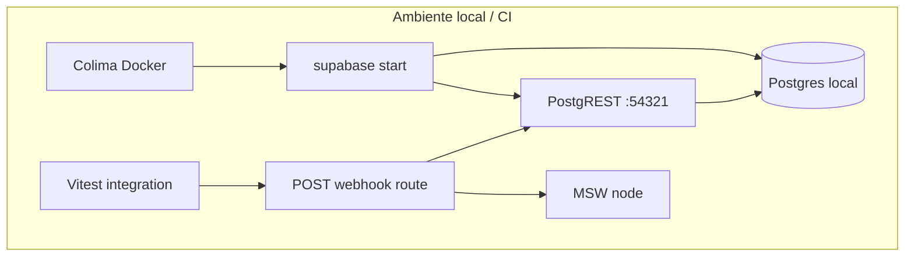

# Fase 1 — Fundações de prova (design spec)

**Data:** 12/07/2026  
**Status:** Aprovado no brainstorming — aguardando implementação  
**Roadmap:** [2026-07-11-roadmap-bot-inteligente-economico.md](../plans/2026-07-11-roadmap-bot-inteligente-economico.md) · **Plano:** [2026-07-12-fase1-fundacoes-de-prova.md](../plans/2026-07-12-fase1-fundacoes-de-prova.md)  
**Branch prevista:** `fix/fase1-fundacoes-de-prova`

**Achados / lacunas:** ausência de `tests/integration/`, ausência de E2E real apesar do script `test:e2e`, COST-18 (esqueleto de eval), 10 erros TypeScript em fixtures/mocks  
**Invariantes:** INV-30 (base), rastreabilidade §15.9 da auditoria

---

## 1. Problema

A Fase 0 fechou o perímetro do webhook em produção. As Fases 2–8 exigem provas que mocks unitários sozinhos não sustentam: transações Postgres, RPCs, constraints, dedup real, concorrência e jornadas conversacionais versionadas.

Hoje o repositório tem:

- **74+ arquivos** de testes unitários com Vitest e MSW parcial;
- **`tests/integration/` inexistente** — nenhum teste contra Postgres real;
- **script `test:e2e`** apontando para Playwright, mas sem config nem testes Playwright;
- **10 erros `tsc --noEmit`** em fixtures/mocks (campos obrigatórios de `MealItem`, `nutrition_basis_*`);
- **nenhum workflow de CI** em `.github/workflows/`, apesar de merge em `main` = deploy em produção.

Sem esta fase, a Fase 2 (inbox durável) não teria como provar idempotência, lease ou fault injection em Postgres real.

---

## 2. Objetivo

Tornar possível **provar** as fases seguintes com:

1. Postgres real local (migrations aplicadas, RPCs e constraints exercitados);
2. E2E in-process do webhook (assinatura → handler → DB → Meta mockada);
3. Esqueleto do golden corpus conversacional (COST-18);
4. CI em PRs que repete os gates localmente reproduzíveis.

**Esta fase não altera código de produção nem `supabase/migrations/`.** Risco de produção: zero.

---

## 3. Decisões de design (aprovadas)

| Tema | Decisão |
|---|---|
| Banco de teste | Supabase CLI local (`colima start` + `supabase start`). **Nunca** o Postgres de produção da VPS — fixtures são destrutivas. Regra operacional em `.cursor/rules/testes-supabase-colima.mdc`. |
| E2E do webhook | **In-process via Vitest**: importa `POST` de `src/app/api/webhook/whatsapp/route.ts`, assina `Request` com HMAC real, MSW intercepta `graph.facebook.com`. Sem Playwright, sem `next start`, sem env vars novas em produção. |
| CI | GitHub Actions em PRs: lint + `tsc --noEmit` + unit + integration/E2E com Supabase local no runner (`supabase/setup-cli` + `supabase start`). Sem segredos de produção. |
| Playwright | Fora do escopo desta fase. O script `test:e2e` permanece no `package.json` para uso futuro do dashboard web; o smoke E2E da Fase 1 vive em `tests/integration/`. |
| Golden corpus | Formato versionado em `tests/corpus/`; 2–3 casos estruturais; **sem runner de LLM** nesta fase — só contrato e documentação. |

---

## 4. Arquitetura



### 4.1 Harness de integração

- **Setup** (`tests/integration/setup.ts`): valida que `NEXT_PUBLIC_SUPABASE_URL` aponta para localhost (recusa URL de produção/VPS); carrega chaves do `supabase status` ou `.env.test.local`.
- **Reset** (`tests/integration/helpers/db-reset.ts`): `TRUNCATE` das tabelas de domínio entre testes (usuários, refeições, `processed_messages`, etc.) com `RESTART IDENTITY CASCADE`.
- **Cliente**: reutiliza `createServiceRoleClient()` de `src/lib/db/supabase.ts` — mesmo caminho de produção (PostgREST/HTTP).
- **Ambiente Vitest**: `environment: 'node'` para `tests/integration/**` via `environmentMatchGlobs` em `vitest.config.ts`; execução **sequencial** (`fileParallelism: false` ou `poolOptions.threads.singleThread`) para evitar corrida no mesmo banco.

### 4.2 E2E in-process do webhook

Fluxo do smoke:

```
1. beforeAll: colima + supabase já rodando (local) ou CI com supabase start
2. MSW server.listen() — captura POST graph.facebook.com
3. Monta payload Meta (texto simples) + assina com META_APP_SECRET de teste
4. Invoca POST(new Request(...)) do route handler
5. Assert: processed_messages tem message_id
6. Assert: MSW recebeu sendTextMessage (body capturado)
7. afterEach: db-reset
```

**Escopo mínimo do smoke:** mensagem de texto que passa pelo dedup e retorna resposta (pode ser onboarding ou help — o importante é provar a cadeia completa sem mockar o Supabase).

**Escopo estendido (mesmo arquivo ou segundo describe):**

- Batch com N `message_id` distintos → N inserts em `processed_messages`;
- Retry com mesmo `message_id` → dedup, sem segunda escrita.

O teste unitário existente em `tests/unit/webhook/route.test.ts` mocka o Supabase; o E2E de integração **não** mocka — é o complemento, não substituto.

### 4.3 Golden corpus (COST-18)

Cada caso em `tests/corpus/cases/*.json` segue o contrato da auditoria §15.2:

```json
{
  "id": "meal_log_banana_simples",
  "description": "Usuário loga banana com quantidade explícita",
  "clock": "2026-07-12T12:30:00-03:00",
  "timezone": "America/Sao_Paulo",
  "initial_state": {
    "onboarding_complete": true,
    "conversation_context": null,
    "existing_meals": []
  },
  "inbound": {
    "type": "text",
    "body": "comi uma banana de 120g no almoço"
  },
  "expected": {
    "structural": {
      "intent": "meal_log",
      "authorized_writes": ["meals", "meal_items"],
      "forbidden_writes": []
    },
    "max_llm_calls": 1,
    "terminal_response_contains": []
  }
}
```

- `tests/corpus/README.md` documenta o schema, como adicionar casos e que o **runner** será implementado na Fase 7 (eval de LLM).
- 2–3 casos de exemplo versionados; nenhum executado automaticamente nesta fase.

### 4.4 Zerar erros TypeScript

Corrigir fixtures/mocks em `tests/unit/` para incluir campos obrigatórios de `MealItem` e `nutrition_basis_*` onde o schema Zod os exige. Sem alterar schemas de produção — só alinhar dados de teste ao contrato atual.

### 4.5 CI (GitHub Actions)

Workflow `.github/workflows/ci.yml`:

| Job | Comandos | Supabase |
|---|---|---|
| `quality` | `npm ci`, `npm run lint`, `npx tsc --noEmit`, `npm run test:unit` | Não |
| `integration` | `npm ci`, `supabase start`, `npm run test:integration` | Sim (action oficial) |

Variáveis de teste injetadas no job `integration` a partir do output do `supabase status` (URL, anon key, service role key) + valores fixos de teste (`META_APP_SECRET=test-meta-app-secret`, `WHATSAPP_PHONE_NUMBER_ID=000000000000000`, `WHATSAPP_VERIFY_TOKEN=test-verify-token`, etc.).

**Não** validar env vars de produção no CI desta fase (isso é gate da auditoria §20.2 para fases que tocam migrations/segredos reais).

---

## 5. Arquivos previstos

### Novos

```
tests/integration/
  setup.ts
  helpers/
    db-reset.ts
    supabase-local.ts          # guard localhost + createServiceRoleClient
    webhook-request.ts         # monta Request assinado
  db/
    find-or-create-meal.test.ts
    processed-messages.test.ts
  webhook/
    webhook-e2e.test.ts
tests/corpus/
  README.md
  schema.json                  # JSON Schema do formato de caso
  cases/
    meal_log_banana_simples.json
    help_menu.json
    dedup_same_message_id.json
.github/workflows/
  ci.yml
.env.test.example              # template para testes locais (chaves do supabase status)
```

### Modificados

```
vitest.config.ts               # environmentMatchGlobs, setupFiles integration
package.json                   # script test:integration explícito (já existe)
tests/unit/**                  # fixtures tsc (Task 1)
docs/superpowers/plans/2026-07-11-roadmap-bot-inteligente-economico.md
```

### Fora de escopo (não criar/modificar)

- `src/**` (código de produção)
- `supabase/migrations/**`
- Playwright config / testes de browser
- Runner executável do golden corpus
- Fault injection / concorrência multi-worker (Fase 2)

---

## 6. Operação local

Antes de `npm run test:integration`:

```bash
colima start
supabase start
# copiar URL e keys de `supabase status` para .env.test.local
```

Depois:

```bash
supabase stop
colima stop
```

---

## 7. Gates de aceitação

- [ ] `npx tsc --noEmit` — 0 erros
- [ ] `npm run test:unit` — verde
- [ ] `npm run test:integration` — ≥1 teste DB + ≥1 smoke E2E webhook verdes
- [ ] `tests/corpus/README.md` + schema + ≥2 casos versionados
- [ ] `.github/workflows/ci.yml` — jobs `quality` e `integration` verdes em PR
- [ ] Nenhuma alteração em `src/` nem `supabase/migrations/`
- [ ] PR mergeado em `main` pelo Otávio

---

## 8. Riscos e mitigações

| Risco | Mitigação |
|---|---|
| Teste aponta para VPS por engano | Guard em `setup.ts` recusa URL não-localhost |
| Corrida entre testes no mesmo DB | Execução sequencial + truncate entre casos |
| CI lento por `supabase start` | Cache Docker no runner; job separado só para integration |
| E2E flaky por LLM real | Smoke usa caminho determinístico (help/onboarding) ou mock pontual só do LLM no teste, documentado no plano |
| Colima/Supabase esquecidos ligados | Regra `.cursor/rules/testes-supabase-colima.mdc` |

---

## 9. Próximo passo após esta fase

Com INV-30 base estabelecido, detalhar e implementar a **Fase 2** (inbox durável) usando a auditoria §20.3 como spec canônica, com provas obrigatórias em Postgres real via o harness criado aqui.
