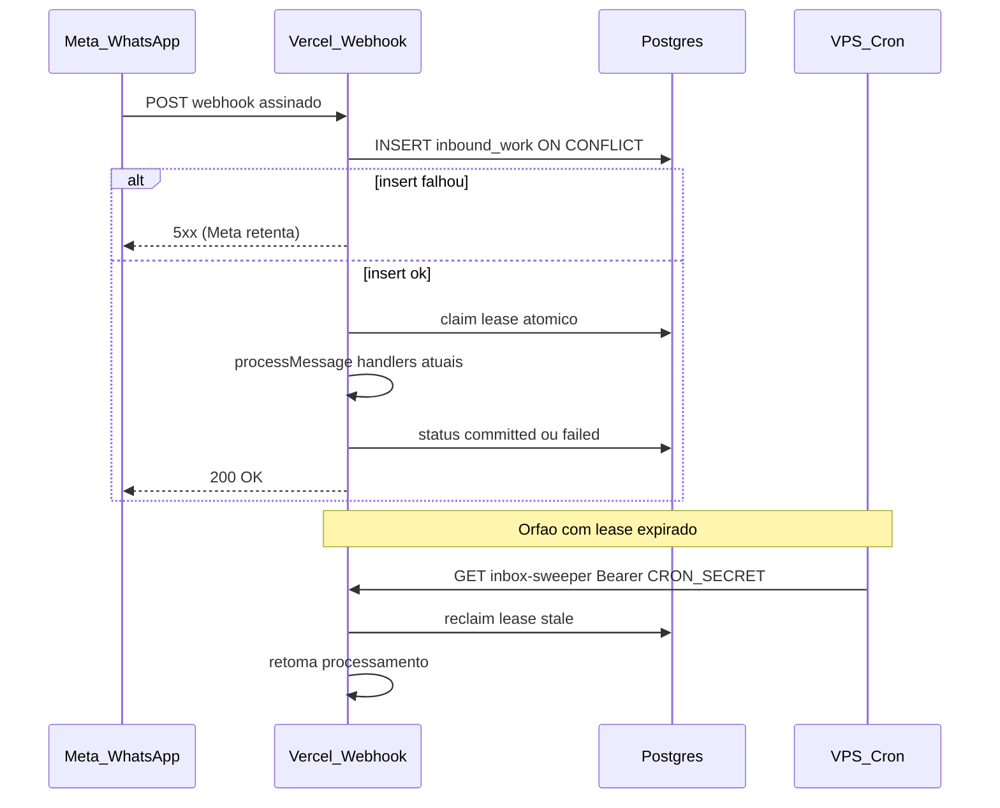

# Fase 2 — Inbox enxuta e identidade de trabalho (design spec)

**Data:** 12/07/2026  
**Status:** Spec + plano de implementação prontos — aguardando implementação na branch `fix/fase2-inbox-enxuta`  
**Roadmap:** [2026-07-11-roadmap-bot-inteligente-economico.md](../plans/2026-07-11-roadmap-bot-inteligente-economico.md)  
**Plano:** [2026-07-12-fase2-inbox-enxuta.md](../plans/2026-07-12-fase2-inbox-enxuta.md)  
**Branch prevista:** `fix/fase2-inbox-enxuta`  
**Spec canônica de referência:** auditoria §20.3 em [2026-07-11-auditoria-conversacional-e-registro-alimentos.md](2026-07-11-auditoria-conversacional-e-registro-alimentos.md)

**Achados:** WEB-03, WEB-04, WEB-05, STATE-11 (início), REL-01, REL-02, REL-15 (parcial), REL-25, COST-15 (parcial), LLM-01 (deadline — início)  
**Invariantes:** INV-03, INV-21, INV-22, INV-25 (parcial), INV-26 (parcial)  
**Fora desta fase:** REL-26 (outbox/callbacks), `domain_operations` / identidade de item (Fase 3)

---

## 1. Problema

O webhook atual ([`src/app/api/webhook/whatsapp/route.ts`](../../../src/app/api/webhook/whatsapp/route.ts)):

1. Insere `message_id` em `processed_messages` **antes** de processar.
2. Em erro de insert (exceto UNIQUE), **processa mesmo assim** (fail-open) — WEB-05.
3. Sempre responde `200 OK`, inclusive após falha no meio do handler.
4. Não tem lease, checkpoint nem retomada: se a invocação Vercel morre após o claim e antes da resposta, a Meta não reenvia (já recebeu 200) e o usuário fica em silêncio — WEB-03/04.

A Fase 0 fechou autenticação e enumeração de eventos. A Fase 1 deu harness de Postgres real e E2E in-process. Falta a camada de **identidade durável do inbound** sem reescrever o bot nem adicionar custo de infra.

---

## 2. Objetivo

Garantir:

1. **ACK ≠ conclusão** — `2xx` só depois de o trabalho estar duravelmente na inbox.
2. **Retry retoma** — crash/timeout após claim não silencia; sweeper ou piggyback retoma.
3. **Sem fail-open** — falha de claim/insert não processa a mensagem.
4. **Identidade estável** — `work_id = unique(provider, business_account_id, provider_message_id)`.
5. **Custo zero extra** — processamento inline na Vercel (Hobby); cron de retomada na VPS já existente.

Não prometemos nesta fase: outbox de saída, reconciliação de delivery Meta, nem `operation_id` por item nutricional (Fase 3).

---

## 3. Decisões de design (aprovadas)

| Tema | Decisão |
|---|---|
| Onde processa | Inline no webhook Vercel, como hoje (`maxDuration = 60`). |
| Onde persiste estado | Postgres do Calorie Bot (mesmo host que produção; migrations em `supabase/migrations/`). |
| Retry antes do ACK | Resposta **não-2xx** se a inbox não gravar → Meta reenvia. |
| Retry após crash | Piggyback (até 1–2 órfãos no início de cada POST) + **cron na VPS** (`ubuntu@137.131.168.96`, host `abigail`) a cada 2 min + cron diário Vercel como rede de segurança. |
| O que a VPS faz | Apenas `curl` autenticado com `CRON_SECRET` para `/api/cron/inbox-sweeper`. Sem lógica de bot, sem worker Node, sem Docker. |
| Custo | Zero: Hobby Vercel + VPS já paga + sem QStash/filas. |
| `processed_messages` | Mantida durante dual-write / feature flag; claim canônico passa a ser `inbound_work`. Remoção definitiva só após gates verdes (pode ficar para PR de limpeza). |
| Outbox / REL-26 | **Fora** — Fase 2b futura. |
| `domain_operations` / item keys | **Fora** — Fase 3. |
| Checkpoint LLM | `plan_json` opcional nesta fase: gravar resultado estruturado mínimo quando o pipeline já o tiver; retry **não** re-chama LLM se checkpoint válido existir. Escopo mínimo: status + lease + payload inbound serializado para retomada. |
| Feature flag | `INBOUND_WORK_ENABLED=true` (env). Com flag off: caminho legado `processed_messages` (comportamento atual, sem fail-open novo). Com flag on: inbox canônica. Rollout: ligar em produção após migration na VPS. |

---

## 4. Arquitetura



### 4.1 Identidade

```text
work_id
  = UUID interno
  UNIQUE(provider, business_account_id, provider_message_id)

provider              = 'whatsapp_cloud' (fix literal)
business_account_id   = WHATSAPP_PHONE_NUMBER_ID (ou waba id se disponível no payload)
provider_message_id   = message.id da Meta (wamid.*)
```

Regras:

- Conteúdo / hash semântico **nunca** é chave de idempotência.
- Duas mensagens diferentes com texto idêntico → dois `work_id`.
- Replay do mesmo `provider_message_id` → mesmo `work_id`; se `committed`, não reprocessa domínio.

### 4.2 Tabela `inbound_work` (migration aditiva)

| Coluna | Tipo | Notas |
|---|---|---|
| `id` | UUID PK | `work_id` |
| `provider` | TEXT NOT NULL | |
| `business_account_id` | TEXT NOT NULL | |
| `provider_message_id` | TEXT NOT NULL | |
| `user_phone` | TEXT | E.164 do remetente (antes de resolver `user_id`) |
| `user_id` | UUID NULL | Preenchido quando usuário conhecido |
| `event_at` | TIMESTAMPTZ | Timestamp do evento Meta (não só relógio de processamento) |
| `received_at` | TIMESTAMPTZ NOT NULL DEFAULT now() | |
| `status` | TEXT NOT NULL | ver §4.3 |
| `attempt` | INTEGER NOT NULL DEFAULT 0 | |
| `lease_owner` | TEXT NULL | id da invocação (ex. uuid gerado no request) |
| `lease_expires_at` | TIMESTAMPTZ NULL | |
| `payload_json` | JSONB NOT NULL | Evento mínimo para retomar (`type`, ids de mídia, texto, quote, phone) |
| `plan_json` | JSONB NULL | Checkpoint de interpretação (quando disponível) |
| `plan_schema_version` | TEXT NULL | |
| `error_code` | TEXT NULL | Sem PII |
| `error_message` | TEXT NULL | Truncado, sem conteúdo bruto do usuário |
| `accepted_at` | TIMESTAMPTZ | |
| `processing_started_at` | TIMESTAMPTZ | |
| `terminal_at` | TIMESTAMPTZ | |
| `created_at` / `updated_at` | TIMESTAMPTZ | |

Constraints:

- `UNIQUE (provider, business_account_id, provider_message_id)`
- Check de `status` nos valores conhecidos
- Índices: `(status, lease_expires_at)` para sweeper; `(user_phone, event_at)` para serialização leve

Grants: `service_role` apenas (espelha RPCs existentes). RLS: negar `anon`/`authenticated` se o padrão do projeto for RLS on.

### 4.3 Status e retry

| Status | Significado | Ação no retry |
|---|---|---|
| `accepted` | Gravado na inbox, ainda sem lease ativo | Claim + processar |
| `processing` | Lease ativo | Se lease fresco: skip; se expirado: reclaim |
| `committed` | Processamento concluído (resposta enviada ou fluxo terminal sem mutação pendente) | No-op |
| `failed_retryable` | Erro transitório | Claim + retentar até teto de attempts |
| `failed_terminal` | Erro permanente / teto atingido | Preservar para suporte; não reprocessar automaticamente |

Teto de attempts (default): **5**. Após isso → `failed_terminal`.

Lease default: **90s** (≥ `maxDuration` 60s + margem).

### 4.4 RPCs

1. **`enqueue_inbound_work(...)`** — `INSERT ... ON CONFLICT DO NOTHING RETURNING` / SELECT existente. Idempotente.
2. **`claim_inbound_work(p_work_id, p_owner, p_lease_seconds)`** — atômico:
   - `accepted` / `failed_retryable` → vira `processing`, seta lease, incrementa `attempt`
   - `processing` com lease expirado → reclaim
   - `processing` fresco / `committed` / `failed_terminal` → `claimed=false`
3. **`complete_inbound_work(p_work_id, p_owner, p_status, ...)`** — só o dono do lease marca `committed` / `failed_*`
4. **`list_stale_inbound_work(p_limit)`** — candidatos para sweeper/piggyback

Padrão de segurança: `SECURITY DEFINER`, `SET search_path = public, pg_temp`, `REVOKE` public/anon/authenticated, `GRANT EXECUTE` só `service_role` (igual [`20260530120000_atomic_find_or_create_meal.sql`](../../../supabase/migrations/20260530120000_atomic_find_or_create_meal.sql)).

### 4.5 Fluxo do webhook (flag on)

Arquivo: [`src/app/api/webhook/whatsapp/route.ts`](../../../src/app/api/webhook/whatsapp/route.ts)

1. Validar assinatura / tamanho (Fase 0 — inalterado).
2. `parseWebhookEvents` → lista.
3. **Piggyback:** chamar `list_stale_inbound_work(2)` e processar órfãos (best-effort; erro não derruba o request atual).
4. Para cada evento de mensagem autenticado (`phone_number_id` ok):
   - Serializar `payload_json` mínimo.
   - `enqueue_inbound_work` — se falhar: marcar request como “inbox dirty” e ao final retornar **503** (não processar esse evento).
   - Se já `committed` / `failed_terminal`: skip.
   - `claim_inbound_work` — se não claimed: skip.
   - `processMessage` (handlers existentes).
   - Sucesso → `complete_inbound_work(..., committed)`.
   - Exceção → `failed_retryable` (ou terminal se attempts esgotados).
5. Se algum enqueue falhou → resposta **503**; senão **200**.

**Remoção explícita do fail-open** do `claimMessage` legado quando a flag estiver on.

### 4.6 Endpoint sweeper

Novo: `src/app/api/cron/inbox-sweeper/route.ts`

- `GET` (ou `POST`) protegido por [`isCronAuthorized`](../../../src/lib/auth/cron.ts).
- Batch: até **5** trabalhos stale por invocação.
- Reutiliza a mesma função de “claim + process + complete” do webhook.
- Resposta JSON: `{ processed, skipped, errors }` (sem PII).

### 4.7 Cron na VPS

Host: `ubuntu@137.131.168.96` (`abigail`).

- Arquivo env restrito: `~/.caloriebot-cron.env` (`chmod 600`) com `CRON_SECRET` e `SWEEPER_URL`.
- Crontab (exemplo):

```bash
*/2 * * * * . $HOME/.caloriebot-cron.env && curl -fsS -H "Authorization: Bearer $CRON_SECRET" "$SWEEPER_URL" >> $HOME/caloriebot-sweeper.log 2>&1
```

- **Não** adicionar schedule frequente em `vercel.json` (Hobby = 1×/dia).
- Rede de segurança: adicionar cron **diário** em `vercel.json` apontando ao mesmo path (ex. `15 4 * * *`), além do sweeper da VPS.

Documentação operacional: snippet no plano de implementação + comentário em `.env.example` (`SWEEPER` / nota VPS). Sem commit de secrets.

### 4.8 Dual-write / feature flag

| `INBOUND_WORK_ENABLED` | Comportamento |
|---|---|
| unset / `false` | Caminho atual `processed_messages`, **mas** fail-open removido: erro de insert → 503 e não processa (hardening mínimo alinhado a WEB-05, seguro em ambos os modos). |
| `true` | Inbox `inbound_work` canônica; `processed_messages` pode receber insert espelho opcional na mesma fase para compat com cron de limpeza, ou ser deixada só para linhas antigas. |

Decisão desta spec: **com flag on, não depende de `processed_messages` para claim**. Insert espelho em `processed_messages` é opcional (YAGNI: omitir a menos que o cron de limpeza quebre). Atualizar cron de limpeza para não apagar linhas necessárias ao diagnóstico.

---

## 5. Escopo explícito fora

- `outbox_messages`, status `delivered`/`read`, REL-26
- `domain_operations`, `meal_items.source_operation_id` (Fase 3)
- Serialização forte multi-intenção / multi-refeição atômica (Fase 3)
- Worker residente, QStash, Redis, upgrade Vercel Pro
- Remoção imediata da tabela `processed_messages`
- Quota/circuit breaker completo (REL-15 parcial: só lease + attempts; rate limit fino fica para refinamento)

---

## 6. Testes e gates

### Integração (Postgres local — Fase 1 harness)

- Duas sessões concorrentes no mesmo `provider_message_id` → um `work_id`.
- Claim concorrente → um `claimed=true`.
- Lease expirado → reclaim; lease fresco → skip.
- Retry com `committed` → não reprocessa.
- Enqueue falho simulado → route não chama handler.

### Unit

- Fail-closed: erro de RPC claim → não processa.
- Flag off vs on (branching).
- Sweeper rejeita sem `CRON_SECRET` / Bearer inválido.

### E2E in-process

- Webhook assinado → `inbound_work` `committed` + handler chamado 1×.
- Replay mesmo `message_id` → handler 0× na segunda.
- Batch de N mensagens → N rows (ou falha por id sem engolir as demais).

### Gates DoD (roadmap §5)

- Plano detalhado aprovado
- Regressões com IDs WEB-03/04/05
- `npm test`, lint, `tsc` verdes
- Migration autorizada e aplicada na VPS **antes ou junto** do deploy com flag on
- `CRON_SECRET` na Vercel e na VPS; sweeper respondendo 200 autenticado

---

## 7. Rollout produção

1. Aplicar migration aditiva no Postgres da VPS (sem feature flag ainda).
2. Deploy do código com `INBOUND_WORK_ENABLED` **false** (fail-closed no legado).
3. Configurar crontab na VPS apontando ao sweeper (pode 401 até flag on — ok).
4. Ligar `INBOUND_WORK_ENABLED=true` na Vercel.
5. Observar logs: enqueue, claim, reclaim, `failed_*`.
6. Rollback: desligar flag; tabelas aditivas permanecem.

---

## 8. Telemetria mínima

Logs estruturados **sem** texto de usuário:

- `work_id`, `provider_message_id`, `status`, `attempt`, `lease_owner`, estágio
- Contadores: reclaim, duplicate skip, enqueue fail, sweeper batch size

---

## 9. Relação com WS5 e §20.3

| Item WS5 / §20.3 | Nesta fase |
|---|---|
| Claim `processing`/`done` em `processed_messages` | Substituído por `inbound_work` + lease |
| ACK após entrega Meta | Simplificado: `committed` após handler concluir (handlers ainda enviam inline) |
| Outbox + callbacks | Adiado |
| `operation_id` / item index | Fase 3 |
| Fail-open | Proibido |

Esta spec é a **versão enxuta** da Fase 2 do roadmap: prova WEB-03/04/05 e base de INV-21/22 sem a arquitetura completa de outbox/operações de domínio.
